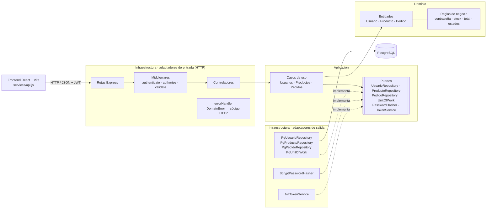
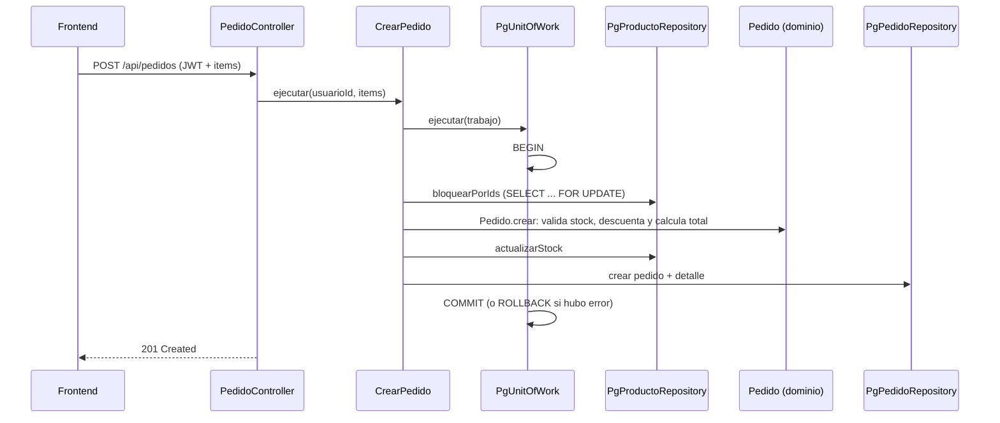

# Pablo Store · Aplicación Full-Stack con Arquitectura Hexagonal

Node.js + Express (backend) · React + Vite (frontend) · PostgreSQL (base de datos)

Proyecto ubicado en `/mnt/c/taller3_24` (en Windows: `C:\taller3_24`), organizado en tres carpetas:

- `database/` script SQL para pgAdmin.
- `backend/` API REST con arquitectura hexagonal (55 archivos).
- `frontend/` aplicación SPA en React (23 archivos).

---

## 1. Script SQL para pgAdmin

Archivo: `database/schema.sql`. Crea las cuatro tablas con llaves primarias, foráneas, restricciones `CHECK`, índices y cinco productos de ejemplo. Si la base ya existía antes del control de acceso de usuarios, se ejecutan una sola vez, en orden, `database/migracion_estado_usuarios.sql` (agrega la columna `estado`) y `database/migracion_rol_gestor.sql` (agrega el rol `gestor_pedidos`), sin borrar datos.

Decisiones de modelado relevantes:

- `usuarios.email` es `UNIQUE`; el backend lo guarda siempre en minúsculas.
- `usuarios.rol` admite `cliente`, `admin` y `gestor_pedidos`.
- `usuarios.estado` controla el acceso: `pendiente` (recién registrado), `activo` (aprobado por un administrador) o `inactivo` (desactivado).
- `usuarios.password` almacena únicamente el hash generado con bcrypt.
- `pedidos.usuario_id` usa `ON DELETE RESTRICT`: no se puede borrar un usuario que tenga pedidos.
- `detalle_pedidos.pedido_id` usa `ON DELETE CASCADE`: al eliminar un pedido se elimina su detalle.
- `detalle_pedidos.precio_unitario` congela el precio al momento de la compra, aunque el producto cambie de precio después.
- Las restricciones `CHECK` impiden precios negativos, stock negativo y estados o roles no válidos, incluso si alguien escribe directamente en la base.

```sql
-- ============================================================
-- Taller 3 - Script de base de datos (PostgreSQL)
-- Ejecutar en pgAdmin > Query Tool conectado a la base taller3_24
-- ============================================================

DROP TABLE IF EXISTS detalle_pedidos;
DROP TABLE IF EXISTS pedidos;
DROP TABLE IF EXISTS productos;
DROP TABLE IF EXISTS usuarios;

-- ---------- usuarios ----------
CREATE TABLE usuarios (
  id              INTEGER GENERATED ALWAYS AS IDENTITY PRIMARY KEY,
  nombre          VARCHAR(100) NOT NULL,
  email           VARCHAR(150) NOT NULL,
  password        VARCHAR(255) NOT NULL,
  rol             VARCHAR(20)  NOT NULL DEFAULT 'cliente',
  estado          VARCHAR(20)  NOT NULL DEFAULT 'pendiente',
  fecha_creacion  TIMESTAMPTZ  NOT NULL DEFAULT NOW(),
  CONSTRAINT uq_usuarios_email UNIQUE (email),
  CONSTRAINT ck_usuarios_rol CHECK (rol IN ('cliente', 'admin', 'gestor_pedidos')),
  CONSTRAINT ck_usuarios_estado CHECK (estado IN ('pendiente', 'activo', 'inactivo'))
);

-- ---------- productos ----------
CREATE TABLE productos (
  id              INTEGER GENERATED ALWAYS AS IDENTITY PRIMARY KEY,
  nombre          VARCHAR(150)  NOT NULL,
  descripcion     TEXT          NOT NULL DEFAULT '',
  precio          NUMERIC(10,2) NOT NULL,
  stock           INTEGER       NOT NULL DEFAULT 0,
  fecha_creacion  TIMESTAMPTZ   NOT NULL DEFAULT NOW(),
  CONSTRAINT ck_productos_precio CHECK (precio >= 0),
  CONSTRAINT ck_productos_stock  CHECK (stock >= 0)
);

-- ---------- pedidos ----------
CREATE TABLE pedidos (
  id              INTEGER GENERATED ALWAYS AS IDENTITY PRIMARY KEY,
  usuario_id      INTEGER       NOT NULL,
  total           NUMERIC(12,2) NOT NULL,
  estado          VARCHAR(20)   NOT NULL DEFAULT 'pendiente',
  fecha_creacion  TIMESTAMPTZ   NOT NULL DEFAULT NOW(),
  CONSTRAINT fk_pedidos_usuario FOREIGN KEY (usuario_id)
    REFERENCES usuarios (id) ON DELETE RESTRICT,
  CONSTRAINT ck_pedidos_total  CHECK (total >= 0),
  CONSTRAINT ck_pedidos_estado CHECK (estado IN ('pendiente', 'completado', 'cancelado'))
);

-- ---------- detalle_pedidos ----------
CREATE TABLE detalle_pedidos (
  id               INTEGER GENERATED ALWAYS AS IDENTITY PRIMARY KEY,
  pedido_id        INTEGER       NOT NULL,
  producto_id      INTEGER       NOT NULL,
  cantidad         INTEGER       NOT NULL,
  precio_unitario  NUMERIC(10,2) NOT NULL,
  CONSTRAINT fk_detalle_pedido FOREIGN KEY (pedido_id)
    REFERENCES pedidos (id) ON DELETE CASCADE,
  CONSTRAINT fk_detalle_producto FOREIGN KEY (producto_id)
    REFERENCES productos (id) ON DELETE RESTRICT,
  CONSTRAINT uq_detalle_pedido_producto UNIQUE (pedido_id, producto_id),
  CONSTRAINT ck_detalle_cantidad CHECK (cantidad > 0),
  CONSTRAINT ck_detalle_precio   CHECK (precio_unitario >= 0)
);

-- ---------- índices ----------
CREATE INDEX idx_usuarios_estado      ON usuarios (estado);
CREATE INDEX idx_productos_nombre      ON productos (LOWER(nombre));
CREATE INDEX idx_pedidos_usuario_id    ON pedidos (usuario_id);
CREATE INDEX idx_pedidos_estado        ON pedidos (estado);
CREATE INDEX idx_pedidos_fecha         ON pedidos (fecha_creacion DESC);
CREATE INDEX idx_detalle_pedido_id     ON detalle_pedidos (pedido_id);
CREATE INDEX idx_detalle_producto_id   ON detalle_pedidos (producto_id);

-- ---------- datos de ejemplo ----------
INSERT INTO productos (nombre, descripcion, precio, stock) VALUES
  ('Teclado mecánico',   'Teclado mecánico RGB con switches rojos',   1299.00, 15),
  ('Mouse inalámbrico',  'Mouse ergonómico de 2.4 GHz, 1600 DPI',       349.50, 30),
  ('Monitor 24"',        'Monitor IPS Full HD de 75 Hz',               2899.00,  8),
  ('Audífonos',          'Audífonos over-ear con cancelación de ruido', 899.90, 20),
  ('Memoria USB 64 GB',  'Memoria USB 3.1 de alta velocidad',            189.00, 50);
```

---

## 2. Diagrama arquitectónico

### 2.1 Capas de la arquitectura hexagonal



Regla de dependencias: el dominio no importa nada externo; la aplicación solo conoce al dominio y a sus propios puertos; la infraestructura implementa los puertos. `src/main.js` es la raíz de composición donde se conectan las implementaciones concretas con los casos de uso.

### 2.2 Flujo transaccional de creación de un pedido



`SELECT ... FOR UPDATE` bloquea las filas de los productos durante la transacción; dos compras simultáneas del último artículo no pueden venderlo dos veces.

---

## 3. Estructura de carpetas

```
backend/
├── src/
│   ├── application/
│   │   ├── ports/
│   │   │   ├── PasswordHasher.js
│   │   │   ├── PedidoRepository.js
│   │   │   ├── ProductoRepository.js
│   │   │   ├── TokenService.js
│   │   │   ├── UnitOfWork.js
│   │   │   └── UsuarioRepository.js
│   │   └── use-cases/
│   │       ├── pedidos/
│   │       │   ├── ActualizarEstadoPedido.js
│   │       │   ├── CrearPedido.js
│   │       │   ├── EliminarPedido.js
│   │       │   ├── ListarPedidos.js
│   │       │   ├── ObtenerPedido.js
│   │       │   └── reponerStock.js
│   │       ├── productos/
│   │       │   ├── ActualizarProducto.js
│   │       │   ├── CrearProducto.js
│   │       │   ├── EliminarProducto.js
│   │       │   ├── ListarProductos.js
│   │       │   └── ObtenerProducto.js
│   │       └── usuarios/
│   │           ├── ActualizarAccesoUsuario.js
│   │           ├── ActualizarUsuario.js
│   │           ├── EliminarUsuario.js
│   │           ├── IniciarSesion.js
│   │           ├── ListarUsuarios.js
│   │           ├── ObtenerUsuario.js
│   │           ├── RegistrarUsuario.js
│   │           └── VerificarSesion.js
│   ├── config/
│   │   └── env.js
│   ├── domain/
│   │   ├── entities/
│   │   │   ├── Pedido.js
│   │   │   ├── Producto.js
│   │   │   └── Usuario.js
│   │   └── errors/
│   │       └── DomainError.js
│   ├── infrastructure/
│   │   ├── database/
│   │   │   ├── PgPedidoRepository.js
│   │   │   ├── PgProductoRepository.js
│   │   │   ├── PgRepository.js
│   │   │   ├── PgUnitOfWork.js
│   │   │   ├── PgUsuarioRepository.js
│   │   │   ├── pool.js
│   │   │   └── traducirErrorPg.js
│   │   ├── http/
│   │   │   ├── controllers/
│   │   │   │   ├── AuthController.js
│   │   │   │   ├── PedidoController.js
│   │   │   │   ├── ProductoController.js
│   │   │   │   └── UsuarioController.js
│   │   │   ├── middlewares/
│   │   │   │   ├── authenticate.js
│   │   │   │   ├── authorize.js
│   │   │   │   ├── errorHandler.js
│   │   │   │   ├── requireActivo.js
│   │   │   │   ├── schemas.js
│   │   │   │   └── validate.js
│   │   │   ├── routes/
│   │   │   │   └── index.js
│   │   │   └── app.js
│   │   └── security/
│   │       ├── BcryptPasswordHasher.js
│   │       └── JwtTokenService.js
│   └── main.js
├── .env.example
├── .gitignore
└── package.json
```

```
frontend/
├── src/
│   ├── components/
│   │   ├── Alerta.jsx
│   │   ├── Navbar.jsx
│   │   └── ProtectedRoute.jsx
│   ├── context/
│   │   ├── AuthContext.jsx
│   │   └── CartContext.jsx
│   ├── features/
│   │   ├── auth/
│   │   │   ├── EsperaPage.jsx
│   │   │   ├── LoginPage.jsx
│   │   │   └── RegisterPage.jsx
│   │   ├── catalog/
│   │   │   ├── CatalogPage.jsx
│   │   │   ├── ProductCard.jsx
│   │   │   └── ProductForm.jsx
│   │   ├── orders/
│   │   │   ├── CartPage.jsx
│   │   │   └── OrdersPage.jsx
│   │   └── users/
│   │       └── UsersPage.jsx
│   ├── services/
│   │   └── api.js
│   ├── App.jsx
│   ├── index.css
│   └── main.jsx
├── .env.example
├── .gitignore
├── index.html
├── package.json
└── vite.config.js
```

```
database/
├── migracion_estado_usuarios.sql
├── migracion_rol_gestor.sql
└── schema.sql
```

---

## 4. Comandos en WSL paso a paso

### Paso 0. Verificar Node.js

```bash
node -v
```

Se requiere Node.js 20.19 o superior (Vite 7 lo exige).

### Paso 1. Colocar el proyecto

Descomprimir el archivo `taller3_24.zip` de forma que exista `C:\taller3_24\backend`, `C:\taller3_24\frontend` y `C:\taller3_24\database`. Después, en WSL:

```bash
cd /mnt/c/taller3_24
ls
```

Deben aparecer `backend`, `database`, `frontend` y `GUIA.md`.

### Paso 2. Crear la base de datos en pgAdmin

1. En pgAdmin, clic derecho en **Databases → Create → Database...**, nombre `taller3_24`, **Save**.
2. Clic derecho sobre la nueva base `taller3_24` → **Query Tool**.
3. Abrir `C:\taller3_24\database\schema.sql` (ícono de carpeta del Query Tool) o pegar su contenido.
4. Ejecutar con **F5**. En **Messages** debe aparecer `Query returned successfully`.
5. Comprobar con `SELECT * FROM productos;` (deben salir 5 productos).

### Paso 3. Comprobar que WSL alcanza a PostgreSQL

PostgreSQL y pgAdmin normalmente están instalados en Windows, mientras que Node se ejecuta en WSL. Se prueba la conexión:

```bash
sudo apt update && sudo apt install -y postgresql-client
psql -h localhost -U postgres -d taller3_24 -c "SELECT COUNT(*) FROM productos;"
```

Si pide la contraseña y devuelve `5`, la conexión funciona y se continúa al Paso 4.

Si falla con `Connection refused`, activar la red en modo espejo de WSL (Windows 11):

1. En Windows, crear o editar `C:\Users\<TU_USUARIO>\.wslconfig` con:

   ```
   [wsl2]
   networkingMode=mirrored
   ```

2. En PowerShell de Windows: `wsl --shutdown`
3. Abrir WSL de nuevo y repetir la prueba de `psql`.

### Paso 4. Instalar y configurar el backend

```bash
cd /mnt/c/taller3_24/backend
npm install
cp .env.example .env
node -e "console.log(require('crypto').randomBytes(48).toString('hex'))"
```

Abrir `backend/.env` en VS Code y completar:

- `DB_PASSWORD`: la contraseña del usuario `postgres` de pgAdmin.
- `JWT_SECRET`: la cadena larga que imprimió el último comando.

### Paso 5. Arrancar el backend (terminal 1)

```bash
cd /mnt/c/taller3_24/backend
npm run dev
```

Salida esperada:

```
Conectado a PostgreSQL (localhost:5432/taller3_24)
API escuchando en http://localhost:3000/api
```

Esta terminal se deja abierta.

### Paso 6. Instalar y arrancar el frontend (terminal 2)

Abrir una segunda terminal de WSL:

```bash
cd /mnt/c/taller3_24/frontend
npm install
cp .env.example .env
npm run dev
```

Abrir `http://localhost:5173` en el navegador. Vite reenvía las peticiones `/api` al backend en el puerto 3000 mediante su proxy.

### Paso 7. Crear el primer administrador

1. En el navegador, registrarse con cualquier cuenta (se crea como `cliente` en estado `pendiente` y muestra la pantalla de espera).
2. En pgAdmin (Query Tool de `taller3_24`):

   ```sql
   UPDATE usuarios SET rol = 'admin', estado = 'activo' WHERE email = 'tu_correo@ejemplo.com';
   ```

3. En la aplicación, pulsar **Comprobar ahora** en la pantalla de espera (o esperar 10 segundos). El backend consulta el rol y el estado en cada petición, por lo que no es necesario volver a iniciar sesión.

Con el rol `admin` aparecen la sección **Usuarios** y los botones para gestionar productos y pedidos. A partir de aquí, cada cuenta nueva se aprueba desde **Usuarios**.

### Paso 8. Revisión de código con Oxlint

```bash
cd /mnt/c/taller3_24/frontend && npm run lint
```

---

## 5. Código fuente completo

Cada bloque indica la ruta relativa exacta desde `/mnt/c/taller3_24`. Los archivos `.env` no se incluyen porque se generan a partir de `.env.example` en el Paso 4 y el Paso 6.

### 5.1 Backend

#### `backend/package.json`

```json
{
  "name": "backend",
  "version": "1.0.0",
  "description": "API REST con arquitectura hexagonal (Node.js + Express + PostgreSQL)",
  "main": "src/main.js",
  "scripts": {
    "start": "node src/main.js",
    "dev": "nodemon src/main.js"
  },
  "dependencies": {
    "bcryptjs": "^3.0.2",
    "cors": "^2.8.5",
    "dotenv": "^17.2.0",
    "express": "^5.1.0",
    "jsonwebtoken": "^9.0.2",
    "pg": "^8.16.0"
  },
  "devDependencies": {
    "nodemon": "^3.1.10"
  }
}
```

#### `backend/.env.example`

```bash
PORT=3000
CORS_ORIGIN=http://localhost:5173

DB_HOST=localhost
DB_PORT=5432
DB_USER=postgres
DB_PASSWORD=tu_password_de_postgres
DB_NAME=taller3_24

JWT_SECRET=reemplaza_por_una_cadena_larga_y_aleatoria
JWT_EXPIRES_IN=2h
BCRYPT_ROUNDS=10
```

#### `backend/.gitignore`

```bash
node_modules/
.env
```

#### `backend/src/config/env.js`

```javascript
const path = require("path");
require("dotenv").config({ path: path.resolve(__dirname, "../../.env"), quiet: true });

const requerida = (nombre) => {
  const valor = process.env[nombre];
  if (!valor) throw new Error(`Falta la variable de entorno ${nombre} en backend/.env`);
  return valor;
};

module.exports = {
  port: Number(process.env.PORT) || 3000,
  corsOrigin: process.env.CORS_ORIGIN || "http://localhost:5173",
  db: {
    host: requerida("DB_HOST"),
    port: Number(process.env.DB_PORT) || 5432,
    user: requerida("DB_USER"),
    password: process.env.DB_PASSWORD || "",
    database: requerida("DB_NAME"),
  },
  jwt: {
    secret: requerida("JWT_SECRET"),
    expiresIn: process.env.JWT_EXPIRES_IN || "2h",
  },
  bcryptRounds: Number(process.env.BCRYPT_ROUNDS) || 10,
};
```

#### `backend/src/domain/errors/DomainError.js`

```javascript
// Error de negocio. El tipo se traduce a un código HTTP en la capa de infraestructura.
class DomainError extends Error {
  constructor(message, type, details) {
    super(message);
    this.name = "DomainError";
    this.type = type;
    this.details = details;
  }

  static validation(message, details) {
    return new DomainError(message, "VALIDATION", details);
  }

  static unauthorized(message = "No autenticado") {
    return new DomainError(message, "UNAUTHORIZED");
  }

  static forbidden(message = "No tienes permiso para realizar esta acción") {
    return new DomainError(message, "FORBIDDEN");
  }

  static notFound(message) {
    return new DomainError(message, "NOT_FOUND");
  }

  static conflict(message) {
    return new DomainError(message, "CONFLICT");
  }
}

module.exports = DomainError;
```

#### `backend/src/domain/entities/Usuario.js`

```javascript
const DomainError = require("../errors/DomainError");

const ROLES = ["cliente", "admin", "gestor_pedidos"];
// Roles del personal que puede ver y atender todos los pedidos.
const ROLES_GESTION_PEDIDOS = ["admin", "gestor_pedidos"];
const ESTADOS = ["pendiente", "activo", "inactivo"];
const EMAIL_REGEX = /^[^\s@]+@[^\s@]+\.[^\s@]+$/;

class Usuario {
  constructor({ id = null, nombre, email, password = null, rol = "cliente", estado = "pendiente", fechaCreacion = null }) {
    this.id = id;
    this.nombre = nombre;
    this.email = email;
    this.password = password;
    this.rol = rol;
    this.estado = estado;
    this.fechaCreacion = fechaCreacion;
  }

  static validarNombre(nombre) {
    const valor = String(nombre ?? "").trim();
    if (valor.length < 2 || valor.length > 100) {
      throw DomainError.validation("El nombre debe tener entre 2 y 100 caracteres");
    }
    return valor;
  }

  static validarEmail(email) {
    const valor = String(email ?? "").trim().toLowerCase();
    if (!EMAIL_REGEX.test(valor) || valor.length > 150) {
      throw DomainError.validation("El email no tiene un formato válido");
    }
    return valor;
  }

  // Regla de negocio: mínimo 8 caracteres, al menos una letra y un número.
  static validarPassword(password) {
    const valida =
      typeof password === "string" &&
      password.length >= 8 &&
      password.length <= 72 &&
      /[A-Za-z]/.test(password) &&
      /\d/.test(password);

    if (!valida) {
      throw DomainError.validation(
        "La contraseña debe tener entre 8 y 72 caracteres e incluir letras y números"
      );
    }
  }

  static validarRol(rol) {
    if (!ROLES.includes(rol)) {
      throw DomainError.validation(`El rol debe ser uno de: ${ROLES.join(", ")}`);
    }
    return rol;
  }

  static validarEstado(estado) {
    if (!ESTADOS.includes(estado)) {
      throw DomainError.validation(`El estado debe ser uno de: ${ESTADOS.join(", ")}`);
    }
    return estado;
  }

  // Regla de negocio: toda cuenta nueva queda pendiente hasta que un administrador la apruebe.
  static crear({ nombre, email, passwordHash }) {
    return new Usuario({
      nombre: Usuario.validarNombre(nombre),
      email: Usuario.validarEmail(email),
      password: passwordHash,
      rol: "cliente",
      estado: "pendiente",
    });
  }

  actualizar({ nombre, email, rol }) {
    if (nombre !== undefined) this.nombre = Usuario.validarNombre(nombre);
    if (email !== undefined) this.email = Usuario.validarEmail(email);
    if (rol !== undefined) this.rol = Usuario.validarRol(rol);
  }

  // Regla de negocio: una cuenta no puede regresar a "pendiente" una vez revisada.
  cambiarAcceso({ rol, estado }) {
    if (rol !== undefined) this.rol = Usuario.validarRol(rol);
    if (estado !== undefined) {
      Usuario.validarEstado(estado);
      if (estado === "pendiente" && this.estado !== "pendiente") {
        throw DomainError.conflict("Una cuenta ya revisada no puede volver a quedar pendiente");
      }
      this.estado = estado;
    }
  }

  esAdmin() {
    return this.rol === "admin";
  }

  // Regla de negocio: el administrador y el gestor de pedidos atienden los pedidos de todos los clientes.
  static gestionaPedidos(rol) {
    return ROLES_GESTION_PEDIDOS.includes(rol);
  }

  estaActivo() {
    return this.estado === "activo";
  }

  // Representación segura: nunca expone la contraseña.
  toPublic() {
    return {
      id: this.id,
      nombre: this.nombre,
      email: this.email,
      rol: this.rol,
      estado: this.estado,
      fechaCreacion: this.fechaCreacion,
    };
  }
}

Usuario.ROLES = ROLES;
Usuario.ESTADOS = ESTADOS;

module.exports = Usuario;
```

#### `backend/src/domain/entities/Producto.js`

```javascript
const DomainError = require("../errors/DomainError");

class Producto {
  constructor({ id = null, nombre, descripcion = "", precio, stock, fechaCreacion = null }) {
    this.id = id;
    this.nombre = nombre;
    this.descripcion = descripcion;
    this.precio = precio;
    this.stock = stock;
    this.fechaCreacion = fechaCreacion;
  }

  static validarNombre(nombre) {
    const valor = String(nombre ?? "").trim();
    if (valor.length < 2 || valor.length > 150) {
      throw DomainError.validation("El nombre del producto debe tener entre 2 y 150 caracteres");
    }
    return valor;
  }

  static validarDescripcion(descripcion) {
    return String(descripcion ?? "").trim();
  }

  static validarPrecio(precio) {
    const valor = Number(precio);
    if (!Number.isFinite(valor) || valor < 0 || valor > 99999999.99) {
      throw DomainError.validation("El precio debe ser un número mayor o igual a 0");
    }
    return Math.round(valor * 100) / 100;
  }

  static validarStock(stock) {
    const valor = Number(stock);
    if (!Number.isInteger(valor) || valor < 0) {
      throw DomainError.validation("El stock debe ser un número entero mayor o igual a 0");
    }
    return valor;
  }

  static crear({ nombre, descripcion, precio, stock }) {
    return new Producto({
      nombre: Producto.validarNombre(nombre),
      descripcion: Producto.validarDescripcion(descripcion),
      precio: Producto.validarPrecio(precio),
      stock: Producto.validarStock(stock),
    });
  }

  actualizar({ nombre, descripcion, precio, stock }) {
    if (nombre !== undefined) this.nombre = Producto.validarNombre(nombre);
    if (descripcion !== undefined) this.descripcion = Producto.validarDescripcion(descripcion);
    if (precio !== undefined) this.precio = Producto.validarPrecio(precio);
    if (stock !== undefined) this.stock = Producto.validarStock(stock);
  }

  // Regla de negocio: comprobación de stock disponible.
  tieneStock(cantidad) {
    return this.stock >= cantidad;
  }

  descontarStock(cantidad) {
    if (!this.tieneStock(cantidad)) {
      throw DomainError.conflict(
        `Stock insuficiente para "${this.nombre}" (disponible: ${this.stock}, solicitado: ${cantidad})`
      );
    }
    this.stock -= cantidad;
  }

  reponerStock(cantidad) {
    this.stock += cantidad;
  }
}

module.exports = Producto;
```

#### `backend/src/domain/entities/Pedido.js`

```javascript
const DomainError = require("../errors/DomainError");

const ESTADOS = ["pendiente", "completado", "cancelado"];
const TRANSICIONES = {
  pendiente: ["completado", "cancelado"],
  completado: [],
  cancelado: [],
};

class Pedido {
  constructor({
    id = null,
    usuarioId,
    total,
    estado = "pendiente",
    fechaCreacion = null,
    detalles = [],
    cliente = null,
  }) {
    this.id = id;
    this.usuarioId = usuarioId;
    this.total = total;
    this.estado = estado;
    this.fechaCreacion = fechaCreacion;
    this.detalles = detalles;
    this.cliente = cliente;
  }

  // Valida los artículos y agrupa cantidades repetidas del mismo producto.
  static normalizarItems(items) {
    if (!Array.isArray(items) || items.length === 0) {
      throw DomainError.validation("El pedido debe contener al menos un producto");
    }

    const agrupados = new Map();
    for (const item of items) {
      const productoId = Number(item?.productoId);
      const cantidad = Number(item?.cantidad);

      if (!Number.isInteger(productoId) || productoId <= 0) {
        throw DomainError.validation("Cada artículo debe tener un productoId válido");
      }
      if (!Number.isInteger(cantidad) || cantidad <= 0) {
        throw DomainError.validation("Cada artículo debe tener una cantidad entera mayor a 0");
      }
      agrupados.set(productoId, (agrupados.get(productoId) ?? 0) + cantidad);
    }

    return [...agrupados].map(([productoId, cantidad]) => ({ productoId, cantidad }));
  }

  // Regla de negocio: cálculo del total en centavos para evitar errores de redondeo.
  static calcularTotal(detalles) {
    const centavos = detalles.reduce(
      (suma, d) => suma + Math.round(d.precioUnitario * 100) * d.cantidad,
      0
    );
    return centavos / 100;
  }

  // productos: Map<productoId, Producto> con los productos bloqueados en la transacción.
  static crear({ usuarioId, items, productos }) {
    const detalles = Pedido.normalizarItems(items).map(({ productoId, cantidad }) => {
      const producto = productos.get(productoId);
      if (!producto) throw DomainError.notFound(`El producto ${productoId} no existe`);

      producto.descontarStock(cantidad);

      return {
        productoId,
        nombreProducto: producto.nombre,
        cantidad,
        precioUnitario: producto.precio,
        subtotal: Pedido.calcularTotal([{ precioUnitario: producto.precio, cantidad }]),
      };
    });

    return new Pedido({ usuarioId, total: Pedido.calcularTotal(detalles), detalles });
  }

  static validarEstado(estado) {
    if (!ESTADOS.includes(estado)) {
      throw DomainError.validation(`El estado debe ser uno de: ${ESTADOS.join(", ")}`);
    }
    return estado;
  }

  cambiarEstado(nuevoEstado) {
    Pedido.validarEstado(nuevoEstado);
    if (!TRANSICIONES[this.estado].includes(nuevoEstado)) {
      throw DomainError.conflict(`No se puede cambiar un pedido ${this.estado} a ${nuevoEstado}`);
    }
    this.estado = nuevoEstado;
  }

  estaPendiente() {
    return this.estado === "pendiente";
  }

  perteneceA(usuarioId) {
    return this.usuarioId === usuarioId;
  }
}

Pedido.ESTADOS = ESTADOS;

module.exports = Pedido;
```

#### `backend/src/application/ports/PasswordHasher.js`

```javascript
// oxlint-disable no-unused-vars -- los parámetros documentan el contrato que implementa cada adaptador
// Puerto de salida: cifrado de contraseñas.
class PasswordHasher {
  async hash(password) { throw new Error("No implementado: hash"); }
  async comparar(password, hash) { throw new Error("No implementado: comparar"); }
}

module.exports = PasswordHasher;
```

#### `backend/src/application/ports/PedidoRepository.js`

```javascript
// oxlint-disable no-unused-vars -- los parámetros documentan el contrato que implementa cada adaptador
// Puerto de salida: persistencia de pedidos y su detalle.
class PedidoRepository {
  async crear(pedido) { throw new Error("No implementado: crear"); }
  async buscarPorId(id, opciones) { throw new Error("No implementado: buscarPorId"); }
  async listar(filtros) { throw new Error("No implementado: listar"); }
  async actualizarEstado(id, estado) { throw new Error("No implementado: actualizarEstado"); }
  async eliminar(id) { throw new Error("No implementado: eliminar"); }
}

module.exports = PedidoRepository;
```

#### `backend/src/application/ports/ProductoRepository.js`

```javascript
// oxlint-disable no-unused-vars -- los parámetros documentan el contrato que implementa cada adaptador
// Puerto de salida: persistencia de productos.
class ProductoRepository {
  async crear(producto) { throw new Error("No implementado: crear"); }
  async buscarPorId(id) { throw new Error("No implementado: buscarPorId"); }
  async listar(filtros) { throw new Error("No implementado: listar"); }
  async actualizar(producto) { throw new Error("No implementado: actualizar"); }
  async eliminar(id) { throw new Error("No implementado: eliminar"); }
  // Obtiene y bloquea filas dentro de una transacción (evita vender el mismo stock dos veces).
  async bloquearPorIds(ids) { throw new Error("No implementado: bloquearPorIds"); }
  async actualizarStock(id, stock) { throw new Error("No implementado: actualizarStock"); }
}

module.exports = ProductoRepository;
```

#### `backend/src/application/ports/TokenService.js`

```javascript
// oxlint-disable no-unused-vars -- los parámetros documentan el contrato que implementa cada adaptador
// Puerto de salida: emisión y verificación de tokens de autenticación.
class TokenService {
  generar(payload) { throw new Error("No implementado: generar"); }
  verificar(token) { throw new Error("No implementado: verificar"); }
}

module.exports = TokenService;
```

#### `backend/src/application/ports/UnitOfWork.js`

```javascript
// oxlint-disable no-unused-vars -- los parámetros documentan el contrato que implementa cada adaptador
// Puerto de salida: ejecuta un trabajo dentro de una transacción.
// El trabajo recibe repositorios que comparten la misma transacción.
class UnitOfWork {
  async ejecutar(trabajo) { throw new Error("No implementado: ejecutar"); }
}

module.exports = UnitOfWork;
```

#### `backend/src/application/ports/UsuarioRepository.js`

```javascript
// oxlint-disable no-unused-vars -- los parámetros documentan el contrato que implementa cada adaptador
// Puerto de salida: persistencia de usuarios.
class UsuarioRepository {
  async crear(usuario) { throw new Error("No implementado: crear"); }
  async buscarPorId(id) { throw new Error("No implementado: buscarPorId"); }
  async buscarPorEmail(email) { throw new Error("No implementado: buscarPorEmail"); }
  async listar() { throw new Error("No implementado: listar"); }
  async actualizar(usuario) { throw new Error("No implementado: actualizar"); }
  async eliminar(id) { throw new Error("No implementado: eliminar"); }
}

module.exports = UsuarioRepository;
```

#### `backend/src/application/use-cases/usuarios/ActualizarAccesoUsuario.js`

```javascript
const DomainError = require("../../../domain/errors/DomainError");

// El administrador aprueba, desactiva o reactiva cuentas y decide su rol.
class ActualizarAccesoUsuario {
  constructor({ usuarioRepository }) {
    this.usuarioRepository = usuarioRepository;
  }

  async ejecutar(id, { rol, estado }, solicitante) {
    if (id === solicitante.id) {
      throw DomainError.conflict("No puedes modificar el acceso de tu propia cuenta");
    }

    const usuario = await this.usuarioRepository.buscarPorId(id);
    if (!usuario) throw DomainError.notFound("Usuario no encontrado");

    usuario.cambiarAcceso({ rol, estado });
    const actualizado = await this.usuarioRepository.actualizar(usuario);
    return actualizado.toPublic();
  }
}

module.exports = ActualizarAccesoUsuario;
```

#### `backend/src/application/use-cases/usuarios/ActualizarUsuario.js`

```javascript
const DomainError = require("../../../domain/errors/DomainError");

class ActualizarUsuario {
  constructor({ usuarioRepository }) {
    this.usuarioRepository = usuarioRepository;
  }

  async ejecutar(id, datos, solicitante) {
    const usuario = await this.usuarioRepository.buscarPorId(id);
    if (!usuario) throw DomainError.notFound("Usuario no encontrado");

    if (usuario.id === solicitante.id && datos.rol !== undefined && datos.rol !== usuario.rol) {
      throw DomainError.conflict("No puedes cambiar tu propio rol");
    }

    const emailAnterior = usuario.email;
    usuario.actualizar(datos);

    if (usuario.email !== emailAnterior) {
      const existente = await this.usuarioRepository.buscarPorEmail(usuario.email);
      if (existente) throw DomainError.conflict("El email ya está registrado");
    }

    const actualizado = await this.usuarioRepository.actualizar(usuario);
    return actualizado.toPublic();
  }
}

module.exports = ActualizarUsuario;
```

#### `backend/src/application/use-cases/usuarios/EliminarUsuario.js`

```javascript
const DomainError = require("../../../domain/errors/DomainError");

class EliminarUsuario {
  constructor({ usuarioRepository }) {
    this.usuarioRepository = usuarioRepository;
  }

  async ejecutar(id, solicitante) {
    if (id === solicitante.id) throw DomainError.conflict("No puedes eliminar tu propia cuenta");

    const eliminado = await this.usuarioRepository.eliminar(id);
    if (!eliminado) throw DomainError.notFound("Usuario no encontrado");
  }
}

module.exports = EliminarUsuario;
```

#### `backend/src/application/use-cases/usuarios/IniciarSesion.js`

```javascript
const DomainError = require("../../../domain/errors/DomainError");

class IniciarSesion {
  constructor({ usuarioRepository, passwordHasher, tokenService }) {
    this.usuarioRepository = usuarioRepository;
    this.passwordHasher = passwordHasher;
    this.tokenService = tokenService;
  }

  async ejecutar({ email, password }) {
    const usuario = await this.usuarioRepository.buscarPorEmail(String(email).trim().toLowerCase());
    const valido = usuario && (await this.passwordHasher.comparar(password, usuario.password));

    if (!valido) throw DomainError.unauthorized("Credenciales incorrectas");

    const token = this.tokenService.generar({
      id: usuario.id,
      email: usuario.email,
      rol: usuario.rol,
    });

    return { token, usuario: usuario.toPublic() };
  }
}

module.exports = IniciarSesion;
```

#### `backend/src/application/use-cases/usuarios/ListarUsuarios.js`

```javascript
class ListarUsuarios {
  constructor({ usuarioRepository }) {
    this.usuarioRepository = usuarioRepository;
  }

  async ejecutar() {
    const usuarios = await this.usuarioRepository.listar();
    return usuarios.map((u) => u.toPublic());
  }
}

module.exports = ListarUsuarios;
```

#### `backend/src/application/use-cases/usuarios/ObtenerUsuario.js`

```javascript
const DomainError = require("../../../domain/errors/DomainError");

class ObtenerUsuario {
  constructor({ usuarioRepository }) {
    this.usuarioRepository = usuarioRepository;
  }

  async ejecutar(id) {
    const usuario = await this.usuarioRepository.buscarPorId(id);
    if (!usuario) throw DomainError.notFound("Usuario no encontrado");
    return usuario.toPublic();
  }
}

module.exports = ObtenerUsuario;
```

#### `backend/src/application/use-cases/usuarios/RegistrarUsuario.js`

```javascript
const Usuario = require("../../../domain/entities/Usuario");
const DomainError = require("../../../domain/errors/DomainError");

class RegistrarUsuario {
  constructor({ usuarioRepository, passwordHasher }) {
    this.usuarioRepository = usuarioRepository;
    this.passwordHasher = passwordHasher;
  }

  async ejecutar({ nombre, email, password }) {
    Usuario.validarPassword(password);
    const emailNormalizado = Usuario.validarEmail(email);

    if (await this.usuarioRepository.buscarPorEmail(emailNormalizado)) {
      throw DomainError.conflict("El email ya está registrado");
    }

    const passwordHash = await this.passwordHasher.hash(password);
    const usuario = Usuario.crear({ nombre, email: emailNormalizado, passwordHash });
    const creado = await this.usuarioRepository.crear(usuario);

    return creado.toPublic();
  }
}

module.exports = RegistrarUsuario;
```

#### `backend/src/application/use-cases/usuarios/VerificarSesion.js`

```javascript
const DomainError = require("../../../domain/errors/DomainError");

// Valida el token y obtiene el usuario actualizado desde la base de datos.
// Así, los cambios de rol o de estado aplican de inmediato, sin volver a iniciar sesión.
class VerificarSesion {
  constructor({ tokenService, usuarioRepository }) {
    this.tokenService = tokenService;
    this.usuarioRepository = usuarioRepository;
  }

  async ejecutar(token) {
    const payload = this.tokenService.verificar(token);
    const usuario = await this.usuarioRepository.buscarPorId(payload.id);
    if (!usuario) throw DomainError.unauthorized("La sesión ya no es válida");
    return usuario.toPublic();
  }
}

module.exports = VerificarSesion;
```

#### `backend/src/application/use-cases/productos/ActualizarProducto.js`

```javascript
const DomainError = require("../../../domain/errors/DomainError");

class ActualizarProducto {
  constructor({ productoRepository }) {
    this.productoRepository = productoRepository;
  }

  async ejecutar(id, datos) {
    const producto = await this.productoRepository.buscarPorId(id);
    if (!producto) throw DomainError.notFound("Producto no encontrado");

    producto.actualizar(datos);
    return this.productoRepository.actualizar(producto);
  }
}

module.exports = ActualizarProducto;
```

#### `backend/src/application/use-cases/productos/CrearProducto.js`

```javascript
const Producto = require("../../../domain/entities/Producto");

class CrearProducto {
  constructor({ productoRepository }) {
    this.productoRepository = productoRepository;
  }

  async ejecutar(datos) {
    return this.productoRepository.crear(Producto.crear(datos));
  }
}

module.exports = CrearProducto;
```

#### `backend/src/application/use-cases/productos/EliminarProducto.js`

```javascript
const DomainError = require("../../../domain/errors/DomainError");

class EliminarProducto {
  constructor({ productoRepository }) {
    this.productoRepository = productoRepository;
  }

  async ejecutar(id) {
    const eliminado = await this.productoRepository.eliminar(id);
    if (!eliminado) throw DomainError.notFound("Producto no encontrado");
  }
}

module.exports = EliminarProducto;
```

#### `backend/src/application/use-cases/productos/ListarProductos.js`

```javascript
class ListarProductos {
  constructor({ productoRepository }) {
    this.productoRepository = productoRepository;
  }

  async ejecutar({ busqueda = "" } = {}) {
    return this.productoRepository.listar({ busqueda: String(busqueda).trim() });
  }
}

module.exports = ListarProductos;
```

#### `backend/src/application/use-cases/productos/ObtenerProducto.js`

```javascript
const DomainError = require("../../../domain/errors/DomainError");

class ObtenerProducto {
  constructor({ productoRepository }) {
    this.productoRepository = productoRepository;
  }

  async ejecutar(id) {
    const producto = await this.productoRepository.buscarPorId(id);
    if (!producto) throw DomainError.notFound("Producto no encontrado");
    return producto;
  }
}

module.exports = ObtenerProducto;
```

#### `backend/src/application/use-cases/pedidos/ActualizarEstadoPedido.js`

```javascript
const DomainError = require("../../../domain/errors/DomainError");
const Usuario = require("../../../domain/entities/Usuario");
const reponerStock = require("./reponerStock");

class ActualizarEstadoPedido {
  constructor({ unitOfWork }) {
    this.unitOfWork = unitOfWork;
  }

  async ejecutar(id, estado, solicitante) {
    return this.unitOfWork.ejecutar(async ({ pedidoRepository, productoRepository }) => {
      const pedido = await pedidoRepository.buscarPorId(id, { bloquear: true });
      if (!pedido) throw DomainError.notFound("Pedido no encontrado");

      // Admin y gestor pueden completar o cancelar cualquier pedido; el cliente solo cancelar los suyos.
      if (!Usuario.gestionaPedidos(solicitante.rol)) {
        if (!pedido.perteneceA(solicitante.id)) {
          throw DomainError.forbidden("No puedes modificar pedidos de otros usuarios");
        }
        if (estado !== "cancelado") {
          throw DomainError.forbidden("Solo puedes cancelar tus pedidos");
        }
      }

      pedido.cambiarEstado(estado);
      if (estado === "cancelado") await reponerStock(pedido, productoRepository);

      await pedidoRepository.actualizarEstado(pedido.id, pedido.estado);
      return pedidoRepository.buscarPorId(pedido.id);
    });
  }
}

module.exports = ActualizarEstadoPedido;
```

#### `backend/src/application/use-cases/pedidos/CrearPedido.js`

```javascript
const Pedido = require("../../../domain/entities/Pedido");

class CrearPedido {
  constructor({ unitOfWork }) {
    this.unitOfWork = unitOfWork;
  }

  async ejecutar({ usuarioId, items }) {
    const normalizados = Pedido.normalizarItems(items);
    const ids = normalizados.map((i) => i.productoId);

    // Todo ocurre en una sola transacción: si algo falla, no se descuenta stock ni se crea el pedido.
    return this.unitOfWork.ejecutar(async ({ productoRepository, pedidoRepository }) => {
      const productos = await productoRepository.bloquearPorIds(ids);
      const mapa = new Map(productos.map((p) => [p.id, p]));

      const pedido = Pedido.crear({ usuarioId, items: normalizados, productos: mapa });

      for (const producto of productos) {
        await productoRepository.actualizarStock(producto.id, producto.stock);
      }

      return pedidoRepository.crear(pedido);
    });
  }
}

module.exports = CrearPedido;
```

#### `backend/src/application/use-cases/pedidos/EliminarPedido.js`

```javascript
const DomainError = require("../../../domain/errors/DomainError");
const reponerStock = require("./reponerStock");

class EliminarPedido {
  constructor({ unitOfWork }) {
    this.unitOfWork = unitOfWork;
  }

  async ejecutar(id) {
    await this.unitOfWork.ejecutar(async ({ pedidoRepository, productoRepository }) => {
      const pedido = await pedidoRepository.buscarPorId(id, { bloquear: true });
      if (!pedido) throw DomainError.notFound("Pedido no encontrado");

      // Si el pedido seguía pendiente, su stock aún estaba apartado: se devuelve.
      if (pedido.estaPendiente()) await reponerStock(pedido, productoRepository);

      await pedidoRepository.eliminar(pedido.id);
    });
  }
}

module.exports = EliminarPedido;
```

#### `backend/src/application/use-cases/pedidos/ListarPedidos.js`

```javascript
const Usuario = require("../../../domain/entities/Usuario");

class ListarPedidos {
  constructor({ pedidoRepository }) {
    this.pedidoRepository = pedidoRepository;
  }

  // El personal de pedidos (admin y gestor) ve todos; el cliente solo los suyos.
  async ejecutar(solicitante) {
    const filtros = Usuario.gestionaPedidos(solicitante.rol) ? {} : { usuarioId: solicitante.id };
    return this.pedidoRepository.listar(filtros);
  }
}

module.exports = ListarPedidos;
```

#### `backend/src/application/use-cases/pedidos/ObtenerPedido.js`

```javascript
const DomainError = require("../../../domain/errors/DomainError");
const Usuario = require("../../../domain/entities/Usuario");

class ObtenerPedido {
  constructor({ pedidoRepository }) {
    this.pedidoRepository = pedidoRepository;
  }

  async ejecutar(id, solicitante) {
    const pedido = await this.pedidoRepository.buscarPorId(id);
    if (!pedido) throw DomainError.notFound("Pedido no encontrado");

    if (!Usuario.gestionaPedidos(solicitante.rol) && !pedido.perteneceA(solicitante.id)) {
      throw DomainError.forbidden("No puedes consultar pedidos de otros usuarios");
    }
    return pedido;
  }
}

module.exports = ObtenerPedido;
```

#### `backend/src/application/use-cases/pedidos/reponerStock.js`

```javascript
// Devuelve al inventario las cantidades de un pedido (usado al cancelar o eliminar).
async function reponerStock(pedido, productoRepository) {
  const productos = await productoRepository.bloquearPorIds(pedido.detalles.map((d) => d.productoId));
  const mapa = new Map(productos.map((p) => [p.id, p]));

  for (const detalle of pedido.detalles) {
    const producto = mapa.get(detalle.productoId);
    producto.reponerStock(detalle.cantidad);
    await productoRepository.actualizarStock(producto.id, producto.stock);
  }
}

module.exports = reponerStock;
```

#### `backend/src/infrastructure/database/PgPedidoRepository.js`

```javascript
const PgRepository = require("./PgRepository");
const PedidoRepository = require("../../application/ports/PedidoRepository");
const Pedido = require("../../domain/entities/Pedido");

const SELECT_PEDIDO = `
  SELECT p.*, u.nombre AS cliente_nombre, u.email AS cliente_email
  FROM pedidos p
  JOIN usuarios u ON u.id = p.usuario_id`;

const aDetalle = (fila) => ({
  productoId: fila.producto_id,
  nombreProducto: fila.nombre_producto,
  cantidad: fila.cantidad,
  precioUnitario: Number(fila.precio_unitario),
  subtotal: Number(fila.subtotal),
});

const aEntidad = (fila, detalles = []) =>
  new Pedido({
    id: fila.id,
    usuarioId: fila.usuario_id,
    total: Number(fila.total),
    estado: fila.estado,
    fechaCreacion: fila.fecha_creacion,
    cliente: { nombre: fila.cliente_nombre, email: fila.cliente_email },
    detalles,
  });

class PgPedidoRepository extends PedidoRepository {
  constructor(db) {
    super();
    this.pg = new PgRepository(db);
  }

  async crear(pedido) {
    const { rows } = await this.pg.query(
      "INSERT INTO pedidos (usuario_id, total, estado) VALUES ($1, $2, $3) RETURNING id",
      [pedido.usuarioId, pedido.total, pedido.estado]
    );
    const pedidoId = rows[0].id;

    for (const d of pedido.detalles) {
      await this.pg.query(
        `INSERT INTO detalle_pedidos (pedido_id, producto_id, cantidad, precio_unitario)
         VALUES ($1, $2, $3, $4)`,
        [pedidoId, d.productoId, d.cantidad, d.precioUnitario]
      );
    }

    return this.buscarPorId(pedidoId);
  }

  async buscarPorId(id, { bloquear = false } = {}) {
    const { rows } = await this.pg.query(
      `${SELECT_PEDIDO} WHERE p.id = $1 ${bloquear ? "FOR UPDATE OF p" : ""}`,
      [id]
    );
    if (!rows[0]) return null;

    const detalles = await this.detallesDe([id]);
    return aEntidad(rows[0], detalles.get(id) ?? []);
  }

  async listar({ usuarioId } = {}) {
    const { rows } = usuarioId
      ? await this.pg.query(`${SELECT_PEDIDO} WHERE p.usuario_id = $1 ORDER BY p.fecha_creacion DESC`, [usuarioId])
      : await this.pg.query(`${SELECT_PEDIDO} ORDER BY p.fecha_creacion DESC`);

    const detalles = await this.detallesDe(rows.map((r) => r.id));
    return rows.map((fila) => aEntidad(fila, detalles.get(fila.id) ?? []));
  }

  async actualizarEstado(id, estado) {
    await this.pg.query("UPDATE pedidos SET estado = $1 WHERE id = $2", [estado, id]);
  }

  async eliminar(id) {
    const { rowCount } = await this.pg.query("DELETE FROM pedidos WHERE id = $1", [id]);
    return rowCount > 0;
  }

  // Obtiene el detalle de varios pedidos en una sola consulta.
  async detallesDe(pedidoIds) {
    const mapa = new Map();
    if (pedidoIds.length === 0) return mapa;

    const { rows } = await this.pg.query(
      `SELECT d.pedido_id, d.producto_id, d.cantidad, d.precio_unitario,
              d.cantidad * d.precio_unitario AS subtotal,
              pr.nombre AS nombre_producto
       FROM detalle_pedidos d
       JOIN productos pr ON pr.id = d.producto_id
       WHERE d.pedido_id = ANY($1::int[])
       ORDER BY d.id`,
      [pedidoIds]
    );

    for (const fila of rows) {
      if (!mapa.has(fila.pedido_id)) mapa.set(fila.pedido_id, []);
      mapa.get(fila.pedido_id).push(aDetalle(fila));
    }
    return mapa;
  }
}

module.exports = PgPedidoRepository;
```

#### `backend/src/infrastructure/database/PgProductoRepository.js`

```javascript
const PgRepository = require("./PgRepository");
const ProductoRepository = require("../../application/ports/ProductoRepository");
const Producto = require("../../domain/entities/Producto");

const aEntidad = (fila) =>
  fila &&
  new Producto({
    id: fila.id,
    nombre: fila.nombre,
    descripcion: fila.descripcion,
    precio: Number(fila.precio),
    stock: fila.stock,
    fechaCreacion: fila.fecha_creacion,
  });

class PgProductoRepository extends ProductoRepository {
  constructor(db) {
    super();
    this.pg = new PgRepository(db);
  }

  async crear(producto) {
    const { rows } = await this.pg.query(
      `INSERT INTO productos (nombre, descripcion, precio, stock)
       VALUES ($1, $2, $3, $4) RETURNING *`,
      [producto.nombre, producto.descripcion, producto.precio, producto.stock]
    );
    return aEntidad(rows[0]);
  }

  async buscarPorId(id) {
    const { rows } = await this.pg.query("SELECT * FROM productos WHERE id = $1", [id]);
    return aEntidad(rows[0]);
  }

  async listar({ busqueda = "" } = {}) {
    const { rows } = await this.pg.query(
      `SELECT * FROM productos
       WHERE $1 = '' OR LOWER(nombre) LIKE '%' || LOWER($1) || '%'
       ORDER BY id`,
      [busqueda]
    );
    return rows.map(aEntidad);
  }

  async actualizar(producto) {
    const { rows } = await this.pg.query(
      `UPDATE productos SET nombre = $1, descripcion = $2, precio = $3, stock = $4
       WHERE id = $5 RETURNING *`,
      [producto.nombre, producto.descripcion, producto.precio, producto.stock, producto.id]
    );
    return aEntidad(rows[0]);
  }

  async eliminar(id) {
    const { rowCount } = await this.pg.query("DELETE FROM productos WHERE id = $1", [id]);
    return rowCount > 0;
  }

  async bloquearPorIds(ids) {
    const { rows } = await this.pg.query(
      "SELECT * FROM productos WHERE id = ANY($1::int[]) ORDER BY id FOR UPDATE",
      [ids]
    );
    return rows.map(aEntidad);
  }

  async actualizarStock(id, stock) {
    await this.pg.query("UPDATE productos SET stock = $1 WHERE id = $2", [stock, id]);
  }
}

module.exports = PgProductoRepository;
```

#### `backend/src/infrastructure/database/PgRepository.js`

```javascript
const traducirErrorPg = require("./traducirErrorPg");

// Base común: "db" puede ser el Pool (consultas sueltas) o un Client (dentro de una transacción).
class PgRepository {
  constructor(db) {
    this.db = db;
  }

  async query(sql, params = []) {
    try {
      return await this.db.query(sql, params);
    } catch (error) {
      throw traducirErrorPg(error);
    }
  }
}

module.exports = PgRepository;
```

#### `backend/src/infrastructure/database/PgUnitOfWork.js`

```javascript
const UnitOfWork = require("../../application/ports/UnitOfWork");

// Adaptador de transacciones: BEGIN / COMMIT / ROLLBACK sobre un mismo cliente del pool.
class PgUnitOfWork extends UnitOfWork {
  constructor(pool, crearRepositorios) {
    super();
    this.pool = pool;
    this.crearRepositorios = crearRepositorios;
  }

  async ejecutar(trabajo) {
    const client = await this.pool.connect();
    try {
      await client.query("BEGIN");
      const resultado = await trabajo(this.crearRepositorios(client));
      await client.query("COMMIT");
      return resultado;
    } catch (error) {
      await client.query("ROLLBACK");
      throw error;
    } finally {
      client.release();
    }
  }
}

module.exports = PgUnitOfWork;
```

#### `backend/src/infrastructure/database/PgUsuarioRepository.js`

```javascript
const PgRepository = require("./PgRepository");
const UsuarioRepository = require("../../application/ports/UsuarioRepository");
const Usuario = require("../../domain/entities/Usuario");

const aEntidad = (fila) =>
  fila &&
  new Usuario({
    id: fila.id,
    nombre: fila.nombre,
    email: fila.email,
    password: fila.password,
    rol: fila.rol,
    estado: fila.estado,
    fechaCreacion: fila.fecha_creacion,
  });

class PgUsuarioRepository extends UsuarioRepository {
  constructor(db) {
    super();
    this.pg = new PgRepository(db);
  }

  async crear(usuario) {
    const { rows } = await this.pg.query(
      `INSERT INTO usuarios (nombre, email, password, rol, estado)
       VALUES ($1, $2, $3, $4, $5) RETURNING *`,
      [usuario.nombre, usuario.email, usuario.password, usuario.rol, usuario.estado]
    );
    return aEntidad(rows[0]);
  }

  async buscarPorId(id) {
    const { rows } = await this.pg.query("SELECT * FROM usuarios WHERE id = $1", [id]);
    return aEntidad(rows[0]);
  }

  async buscarPorEmail(email) {
    const { rows } = await this.pg.query("SELECT * FROM usuarios WHERE email = $1", [email]);
    return aEntidad(rows[0]);
  }

  // Los pendientes aparecen primero para que el administrador los atienda.
  async listar() {
    const { rows } = await this.pg.query(
      `SELECT * FROM usuarios
       ORDER BY CASE estado WHEN 'pendiente' THEN 0 WHEN 'activo' THEN 1 ELSE 2 END, id`
    );
    return rows.map(aEntidad);
  }

  async actualizar(usuario) {
    const { rows } = await this.pg.query(
      `UPDATE usuarios SET nombre = $1, email = $2, rol = $3, estado = $4
       WHERE id = $5 RETURNING *`,
      [usuario.nombre, usuario.email, usuario.rol, usuario.estado, usuario.id]
    );
    return aEntidad(rows[0]);
  }

  async eliminar(id) {
    const { rowCount } = await this.pg.query("DELETE FROM usuarios WHERE id = $1", [id]);
    return rowCount > 0;
  }
}

module.exports = PgUsuarioRepository;
```

#### `backend/src/infrastructure/database/pool.js`

```javascript
const { Pool } = require("pg");
const config = require("../../config/env");

const pool = new Pool(config.db);

module.exports = pool;
```

#### `backend/src/infrastructure/database/traducirErrorPg.js`

```javascript
const DomainError = require("../../domain/errors/DomainError");

// Convierte errores técnicos de PostgreSQL en errores de negocio.
function traducirErrorPg(error) {
  switch (error.code) {
    case "23505":
      return DomainError.conflict(
        error.constraint === "uq_usuarios_email"
          ? "El email ya está registrado"
          : "Ya existe un registro con esos datos"
      );
    case "23503":
      return DomainError.conflict(
        "El registro está relacionado con otros datos (por ejemplo, pedidos) y no puede eliminarse"
      );
    case "23514":
      return DomainError.validation("Los datos no cumplen las restricciones de la base de datos");
    case "22P02":
    case "22003":
      return DomainError.validation("Formato de dato inválido");
    default:
      return error;
  }
}

module.exports = traducirErrorPg;
```

#### `backend/src/infrastructure/security/BcryptPasswordHasher.js`

```javascript
const bcrypt = require("bcryptjs");
const PasswordHasher = require("../../application/ports/PasswordHasher");

class BcryptPasswordHasher extends PasswordHasher {
  constructor(rounds = 10) {
    super();
    this.rounds = rounds;
  }

  async hash(password) {
    return bcrypt.hash(password, this.rounds);
  }

  async comparar(password, hash) {
    return bcrypt.compare(String(password ?? ""), hash);
  }
}

module.exports = BcryptPasswordHasher;
```

#### `backend/src/infrastructure/security/JwtTokenService.js`

```javascript
const jwt = require("jsonwebtoken");
const TokenService = require("../../application/ports/TokenService");
const DomainError = require("../../domain/errors/DomainError");

class JwtTokenService extends TokenService {
  constructor({ secret, expiresIn }) {
    super();
    this.secret = secret;
    this.expiresIn = expiresIn;
  }

  generar(payload) {
    return jwt.sign(payload, this.secret, { expiresIn: this.expiresIn });
  }

  verificar(token) {
    try {
      return jwt.verify(token, this.secret);
    } catch {
      throw DomainError.unauthorized("Token inválido o expirado");
    }
  }
}

module.exports = JwtTokenService;
```

#### `backend/src/infrastructure/http/middlewares/authenticate.js`

```javascript
const DomainError = require("../../../domain/errors/DomainError");

// Verifica el token JWT del encabezado Authorization: Bearer <token>
// y carga el usuario actualizado (rol y estado) desde la base de datos.
const crearAuthenticate = (verificarSesion) => async (req, res, next) => {
  const [tipo, token] = (req.headers.authorization ?? "").split(" ");
  if (tipo !== "Bearer" || !token) throw DomainError.unauthorized("Se requiere un token de acceso");

  req.usuario = await verificarSesion.ejecutar(token);
  next();
};

module.exports = crearAuthenticate;
```

#### `backend/src/infrastructure/http/middlewares/authorize.js`

```javascript
const DomainError = require("../../../domain/errors/DomainError");

// Restringe una ruta a ciertos roles. Debe usarse después de authenticate.
const authorize = (...roles) => (req, res, next) => {
  if (!roles.includes(req.usuario?.rol)) throw DomainError.forbidden();
  next();
};

module.exports = authorize;
```

#### `backend/src/infrastructure/http/middlewares/errorHandler.js`

```javascript
const DomainError = require("../../../domain/errors/DomainError");

const STATUS = {
  VALIDATION: 400,
  UNAUTHORIZED: 401,
  FORBIDDEN: 403,
  NOT_FOUND: 404,
  CONFLICT: 409,
};

const notFound = (req, res) => {
  res.status(404).json({ error: `Ruta no encontrada: ${req.method} ${req.originalUrl}` });
};

// eslint-disable-next-line no-unused-vars
const errorHandler = (error, req, res, next) => {
  if (error.type === "entity.parse.failed") {
    return res.status(400).json({ error: "El cuerpo de la petición no es un JSON válido" });
  }

  if (error instanceof DomainError) {
    return res.status(STATUS[error.type] ?? 400).json({
      error: error.message,
      ...(error.details && { detalles: error.details }),
    });
  }

  console.error(error);
  res.status(500).json({ error: "Error interno del servidor" });
};

module.exports = { notFound, errorHandler };
```

#### `backend/src/infrastructure/http/middlewares/requireActivo.js`

```javascript
const DomainError = require("../../../domain/errors/DomainError");

const MENSAJES = {
  pendiente: "Tu cuenta está pendiente de aprobación por un administrador",
  inactivo: "Tu cuenta fue desactivada. Contacta a un administrador",
};

// Solo las cuentas activas pueden operar. Debe usarse después de authenticate.
const requireActivo = (req, res, next) => {
  if (req.usuario.estado !== "activo") throw DomainError.forbidden(MENSAJES[req.usuario.estado]);
  next();
};

module.exports = requireActivo;
```

#### `backend/src/infrastructure/http/middlewares/schemas.js`

```javascript
// Esquemas de validación de entrada para cada endpoint.
module.exports = {
  registro: {
    nombre: { type: "string", required: true },
    email: { type: "string", required: true },
    password: { type: "string", required: true },
  },
  login: {
    email: { type: "string", required: true },
    password: { type: "string", required: true },
  },
  actualizarUsuario: {
    nombre: { type: "string" },
    email: { type: "string" },
    rol: { type: "string", enum: ["cliente", "admin", "gestor_pedidos"] },
  },
  accesoUsuario: {
    rol: { type: "string", enum: ["cliente", "admin", "gestor_pedidos"] },
    estado: { type: "string", enum: ["activo", "inactivo"] },
  },
  crearProducto: {
    nombre: { type: "string", required: true },
    descripcion: { type: "string" },
    precio: { type: "number", required: true },
    stock: { type: "integer", required: true },
  },
  actualizarProducto: {
    nombre: { type: "string" },
    descripcion: { type: "string" },
    precio: { type: "number" },
    stock: { type: "integer" },
  },
  crearPedido: {
    items: { type: "array", required: true },
  },
  estadoPedido: {
    estado: { type: "string", required: true, enum: ["pendiente", "completado", "cancelado"] },
  },
};
```

#### `backend/src/infrastructure/http/middlewares/validate.js`

```javascript
const DomainError = require("../../../domain/errors/DomainError");

const TIPOS = {
  string: (v) => typeof v === "string",
  number: (v) => typeof v === "number" && Number.isFinite(v),
  integer: (v) => Number.isInteger(v),
  array: (v) => Array.isArray(v),
};

// Validación de forma del payload (tipos y campos obligatorios).
// Las reglas de negocio se validan en el dominio.
const validate = (schema) => (req, res, next) => {
  const body = req.body ?? {};
  const errores = [];

  for (const [campo, regla] of Object.entries(schema)) {
    const valor = body[campo];

    if (valor === undefined || valor === null || valor === "") {
      if (regla.required) errores.push(`El campo "${campo}" es obligatorio`);
      continue;
    }
    if (!TIPOS[regla.type](valor)) {
      errores.push(`El campo "${campo}" debe ser de tipo ${regla.type}`);
      continue;
    }
    if (regla.enum && !regla.enum.includes(valor)) {
      errores.push(`El campo "${campo}" debe ser uno de: ${regla.enum.join(", ")}`);
    }
  }

  if (errores.length > 0) throw DomainError.validation("Datos inválidos", errores);
  next();
};

// Valida que :id sea un entero positivo y lo convierte a número.
const validateId = (req, res, next) => {
  const id = Number(req.params.id);
  if (!Number.isInteger(id) || id <= 0) throw DomainError.validation("El id debe ser un entero positivo");
  req.params.id = id;
  next();
};

module.exports = { validate, validateId };
```

#### `backend/src/infrastructure/http/controllers/AuthController.js`

```javascript
class AuthController {
  constructor({ registrarUsuario, iniciarSesion, obtenerUsuario }) {
    this.registrarUsuario = registrarUsuario;
    this.iniciarSesion = iniciarSesion;
    this.obtenerUsuario = obtenerUsuario;
  }

  registrar = async (req, res) => {
    const { nombre, email, password } = req.body;
    res.status(201).json(await this.registrarUsuario.ejecutar({ nombre, email, password }));
  };

  login = async (req, res) => {
    const { email, password } = req.body;
    res.json(await this.iniciarSesion.ejecutar({ email, password }));
  };

  perfil = async (req, res) => {
    res.json(await this.obtenerUsuario.ejecutar(req.usuario.id));
  };
}

module.exports = AuthController;
```

#### `backend/src/infrastructure/http/controllers/PedidoController.js`

```javascript
class PedidoController {
  constructor({ crearPedido, listarPedidos, obtenerPedido, actualizarEstadoPedido, eliminarPedido }) {
    this.crearPedido = crearPedido;
    this.listarPedidos = listarPedidos;
    this.obtenerPedido = obtenerPedido;
    this.actualizarEstadoPedido = actualizarEstadoPedido;
    this.eliminarPedido = eliminarPedido;
  }

  crear = async (req, res) => {
    const pedido = await this.crearPedido.ejecutar({ usuarioId: req.usuario.id, items: req.body.items });
    res.status(201).json(pedido);
  };

  listar = async (req, res) => {
    res.json(await this.listarPedidos.ejecutar(req.usuario));
  };

  obtener = async (req, res) => {
    res.json(await this.obtenerPedido.ejecutar(req.params.id, req.usuario));
  };

  cambiarEstado = async (req, res) => {
    res.json(await this.actualizarEstadoPedido.ejecutar(req.params.id, req.body.estado, req.usuario));
  };

  eliminar = async (req, res) => {
    await this.eliminarPedido.ejecutar(req.params.id);
    res.status(204).end();
  };
}

module.exports = PedidoController;
```

#### `backend/src/infrastructure/http/controllers/ProductoController.js`

```javascript
class ProductoController {
  constructor({ listarProductos, obtenerProducto, crearProducto, actualizarProducto, eliminarProducto }) {
    this.listarProductos = listarProductos;
    this.obtenerProducto = obtenerProducto;
    this.crearProducto = crearProducto;
    this.actualizarProducto = actualizarProducto;
    this.eliminarProducto = eliminarProducto;
  }

  listar = async (req, res) => {
    res.json(await this.listarProductos.ejecutar({ busqueda: req.query.q ?? "" }));
  };

  obtener = async (req, res) => {
    res.json(await this.obtenerProducto.ejecutar(req.params.id));
  };

  crear = async (req, res) => {
    const { nombre, descripcion, precio, stock } = req.body;
    res.status(201).json(await this.crearProducto.ejecutar({ nombre, descripcion, precio, stock }));
  };

  actualizar = async (req, res) => {
    const { nombre, descripcion, precio, stock } = req.body;
    res.json(await this.actualizarProducto.ejecutar(req.params.id, { nombre, descripcion, precio, stock }));
  };

  eliminar = async (req, res) => {
    await this.eliminarProducto.ejecutar(req.params.id);
    res.status(204).end();
  };
}

module.exports = ProductoController;
```

#### `backend/src/infrastructure/http/controllers/UsuarioController.js`

```javascript
class UsuarioController {
  constructor({ listarUsuarios, obtenerUsuario, actualizarUsuario, actualizarAccesoUsuario, eliminarUsuario }) {
    this.listarUsuarios = listarUsuarios;
    this.obtenerUsuario = obtenerUsuario;
    this.actualizarUsuario = actualizarUsuario;
    this.actualizarAccesoUsuario = actualizarAccesoUsuario;
    this.eliminarUsuario = eliminarUsuario;
  }

  listar = async (req, res) => {
    res.json(await this.listarUsuarios.ejecutar());
  };

  obtener = async (req, res) => {
    res.json(await this.obtenerUsuario.ejecutar(req.params.id));
  };

  actualizar = async (req, res) => {
    const { nombre, email, rol } = req.body;
    res.json(await this.actualizarUsuario.ejecutar(req.params.id, { nombre, email, rol }, req.usuario));
  };

  cambiarAcceso = async (req, res) => {
    const { rol, estado } = req.body;
    res.json(await this.actualizarAccesoUsuario.ejecutar(req.params.id, { rol, estado }, req.usuario));
  };

  eliminar = async (req, res) => {
    await this.eliminarUsuario.ejecutar(req.params.id, req.usuario);
    res.status(204).end();
  };
}

module.exports = UsuarioController;
```

#### `backend/src/infrastructure/http/routes/index.js`

```javascript
const { Router } = require("express");
const authorize = require("../middlewares/authorize");
const requireActivo = require("../middlewares/requireActivo");
const { validate, validateId } = require("../middlewares/validate");
const schemas = require("../middlewares/schemas");

function crearRutas({ authenticate, authController, usuarioController, productoController, pedidoController }) {
  const router = Router();
  const activo = [authenticate, requireActivo];
  const soloAdmin = [...activo, authorize("admin")];
  const compradores = [...activo, authorize("cliente", "admin")];

  // Autenticación (el perfil también responde a cuentas pendientes o inactivas)
  router.post("/auth/registro", validate(schemas.registro), authController.registrar);
  router.post("/auth/login", validate(schemas.login), authController.login);
  router.get("/auth/perfil", authenticate, authController.perfil);

  // Usuarios (solo administradores)
  router.get("/usuarios", ...soloAdmin, usuarioController.listar);
  router.get("/usuarios/:id", ...soloAdmin, validateId, usuarioController.obtener);
  router.put("/usuarios/:id", ...soloAdmin, validateId, validate(schemas.actualizarUsuario), usuarioController.actualizar);
  router.patch("/usuarios/:id/acceso", ...soloAdmin, validateId, validate(schemas.accesoUsuario), usuarioController.cambiarAcceso);
  router.delete("/usuarios/:id", ...soloAdmin, validateId, usuarioController.eliminar);

  // Productos (lectura pública, escritura solo administradores)
  router.get("/productos", productoController.listar);
  router.get("/productos/:id", validateId, productoController.obtener);
  router.post("/productos", ...soloAdmin, validate(schemas.crearProducto), productoController.crear);
  router.put("/productos/:id", ...soloAdmin, validateId, validate(schemas.actualizarProducto), productoController.actualizar);
  router.delete("/productos/:id", ...soloAdmin, validateId, productoController.eliminar);

  // Pedidos (comprar: cliente y admin; consultar y cambiar estado: cuentas activas, con permisos
  // según el rol en los casos de uso; eliminar: solo administradores)
  router.post("/pedidos", ...compradores, validate(schemas.crearPedido), pedidoController.crear);
  router.get("/pedidos", ...activo, pedidoController.listar);
  router.get("/pedidos/:id", ...activo, validateId, pedidoController.obtener);
  router.patch("/pedidos/:id/estado", ...activo, validateId, validate(schemas.estadoPedido), pedidoController.cambiarEstado);
  router.delete("/pedidos/:id", ...soloAdmin, validateId, pedidoController.eliminar);

  return router;
}

module.exports = crearRutas;
```

#### `backend/src/infrastructure/http/app.js`

```javascript
const express = require("express");
const cors = require("cors");
const crearRutas = require("./routes");
const { notFound, errorHandler } = require("./middlewares/errorHandler");

// Express 5 envía automáticamente al errorHandler los errores de funciones async.
function crearApp({ corsOrigin, ...dependencias }) {
  const app = express();

  app.use(cors({ origin: corsOrigin }));
  app.use(express.json());

  app.get("/api/health", (req, res) => res.json({ estado: "ok" }));
  app.use("/api", crearRutas(dependencias));

  app.use(notFound);
  app.use(errorHandler);

  return app;
}

module.exports = crearApp;
```

#### `backend/src/main.js`

```javascript
// Raíz de composición: crea los adaptadores, los inyecta en los casos de uso y levanta el servidor.
const config = require("./config/env");

// Infraestructura
const pool = require("./infrastructure/database/pool");
const PgUsuarioRepository = require("./infrastructure/database/PgUsuarioRepository");
const PgProductoRepository = require("./infrastructure/database/PgProductoRepository");
const PgPedidoRepository = require("./infrastructure/database/PgPedidoRepository");
const PgUnitOfWork = require("./infrastructure/database/PgUnitOfWork");
const BcryptPasswordHasher = require("./infrastructure/security/BcryptPasswordHasher");
const JwtTokenService = require("./infrastructure/security/JwtTokenService");
const crearAuthenticate = require("./infrastructure/http/middlewares/authenticate");
const crearApp = require("./infrastructure/http/app");

// Controladores
const AuthController = require("./infrastructure/http/controllers/AuthController");
const UsuarioController = require("./infrastructure/http/controllers/UsuarioController");
const ProductoController = require("./infrastructure/http/controllers/ProductoController");
const PedidoController = require("./infrastructure/http/controllers/PedidoController");

// Casos de uso
const RegistrarUsuario = require("./application/use-cases/usuarios/RegistrarUsuario");
const IniciarSesion = require("./application/use-cases/usuarios/IniciarSesion");
const ObtenerUsuario = require("./application/use-cases/usuarios/ObtenerUsuario");
const ListarUsuarios = require("./application/use-cases/usuarios/ListarUsuarios");
const ActualizarUsuario = require("./application/use-cases/usuarios/ActualizarUsuario");
const EliminarUsuario = require("./application/use-cases/usuarios/EliminarUsuario");
const VerificarSesion = require("./application/use-cases/usuarios/VerificarSesion");
const ActualizarAccesoUsuario = require("./application/use-cases/usuarios/ActualizarAccesoUsuario");
const CrearProducto = require("./application/use-cases/productos/CrearProducto");
const ListarProductos = require("./application/use-cases/productos/ListarProductos");
const ObtenerProducto = require("./application/use-cases/productos/ObtenerProducto");
const ActualizarProducto = require("./application/use-cases/productos/ActualizarProducto");
const EliminarProducto = require("./application/use-cases/productos/EliminarProducto");
const CrearPedido = require("./application/use-cases/pedidos/CrearPedido");
const ListarPedidos = require("./application/use-cases/pedidos/ListarPedidos");
const ObtenerPedido = require("./application/use-cases/pedidos/ObtenerPedido");
const ActualizarEstadoPedido = require("./application/use-cases/pedidos/ActualizarEstadoPedido");
const EliminarPedido = require("./application/use-cases/pedidos/EliminarPedido");

// Adaptadores
const crearRepositorios = (db) => ({
  usuarioRepository: new PgUsuarioRepository(db),
  productoRepository: new PgProductoRepository(db),
  pedidoRepository: new PgPedidoRepository(db),
});
const { usuarioRepository, productoRepository, pedidoRepository } = crearRepositorios(pool);
const unitOfWork = new PgUnitOfWork(pool, crearRepositorios);
const passwordHasher = new BcryptPasswordHasher(config.bcryptRounds);
const tokenService = new JwtTokenService(config.jwt);

// Casos de uso
const obtenerUsuario = new ObtenerUsuario({ usuarioRepository });

const app = crearApp({
  corsOrigin: config.corsOrigin,
  authenticate: crearAuthenticate(new VerificarSesion({ tokenService, usuarioRepository })),
  authController: new AuthController({
    registrarUsuario: new RegistrarUsuario({ usuarioRepository, passwordHasher }),
    iniciarSesion: new IniciarSesion({ usuarioRepository, passwordHasher, tokenService }),
    obtenerUsuario,
  }),
  usuarioController: new UsuarioController({
    listarUsuarios: new ListarUsuarios({ usuarioRepository }),
    obtenerUsuario,
    actualizarUsuario: new ActualizarUsuario({ usuarioRepository }),
    actualizarAccesoUsuario: new ActualizarAccesoUsuario({ usuarioRepository }),
    eliminarUsuario: new EliminarUsuario({ usuarioRepository }),
  }),
  productoController: new ProductoController({
    listarProductos: new ListarProductos({ productoRepository }),
    obtenerProducto: new ObtenerProducto({ productoRepository }),
    crearProducto: new CrearProducto({ productoRepository }),
    actualizarProducto: new ActualizarProducto({ productoRepository }),
    eliminarProducto: new EliminarProducto({ productoRepository }),
  }),
  pedidoController: new PedidoController({
    crearPedido: new CrearPedido({ unitOfWork }),
    listarPedidos: new ListarPedidos({ pedidoRepository }),
    obtenerPedido: new ObtenerPedido({ pedidoRepository }),
    actualizarEstadoPedido: new ActualizarEstadoPedido({ unitOfWork }),
    eliminarPedido: new EliminarPedido({ unitOfWork }),
  }),
});

async function iniciar() {
  try {
    await pool.query("SELECT 1");
    console.log(`Conectado a PostgreSQL (${config.db.host}:${config.db.port}/${config.db.database})`);
  } catch (error) {
    console.error("No se pudo conectar a PostgreSQL:", error.message);
    console.error("Revisa los valores DB_* de backend/.env y que el servidor de PostgreSQL esté encendido.");
    process.exit(1);
  }

  app.listen(config.port, () => {
    console.log(`API escuchando en http://localhost:${config.port}/api`);
  });
}

iniciar();
```

### 5.2 Frontend

#### `frontend/package.json`

```json
{
  "name": "frontend",
  "private": true,
  "version": "1.0.0",
  "type": "module",
  "scripts": {
    "dev": "vite",
    "build": "vite build",
    "preview": "vite preview",
    "lint": "oxlint src"
  },
  "dependencies": {
    "react": "^19.1.0",
    "react-dom": "^19.1.0",
    "react-router-dom": "^7.6.0"
  },
  "devDependencies": {
    "@vitejs/plugin-react": "^5.0.0",
    "oxlint": "^1.0.0",
    "vite": "^7.0.0"
  }
}
```

#### `frontend/vite.config.js`

```javascript
import { defineConfig } from "vite";
import react from "@vitejs/plugin-react";

// El proxy reenvía /api al backend: el navegador ve un solo origen y se evitan problemas de CORS.
export default defineConfig({
  plugins: [react()],
  server: {
    port: 5173,
    proxy: {
      "/api": "http://localhost:3000",
    },
  },
});
```

#### `frontend/.env.example`

```bash
# Déjalo en /api para usar el proxy de Vite (recomendado).
VITE_API_URL=/api
```

#### `frontend/.gitignore`

```bash
node_modules/
dist/
.env
```

#### `frontend/index.html`

```html
<!doctype html>
<html lang="es">
  <head>
    <meta charset="UTF-8" />
    <meta name="viewport" content="width=device-width, initial-scale=1.0" />
    <title>Pablo Store</title>
    <link rel="preconnect" href="https://fonts.googleapis.com" />
    <link href="https://fonts.googleapis.com/css2?family=Inter:wght@400;500;600;700&display=swap" rel="stylesheet" />
  </head>
  <body>
    <div id="root"></div>
    <script type="module" src="/src/main.jsx"></script>
  </body>
</html>
```

#### `frontend/src/services/api.js`

```javascript
// Servicio de red aislado: toda comunicación con el backend pasa por aquí.
const BASE_URL = import.meta.env.VITE_API_URL || "/api";
const TOKEN_KEY = "taller3_token";

export const tokenStorage = {
  get: () => localStorage.getItem(TOKEN_KEY),
  set: (token) => localStorage.setItem(TOKEN_KEY, token),
  clear: () => localStorage.removeItem(TOKEN_KEY),
};

export class ApiError extends Error {
  constructor(message, status, detalles = []) {
    super(message);
    this.status = status;
    this.detalles = detalles;
  }
}

async function request(path, { method = "GET", body } = {}) {
  const token = tokenStorage.get();
  const headers = { "Content-Type": "application/json" };
  if (token) headers.Authorization = `Bearer ${token}`;

  const opciones = { method, headers };
  if (body) opciones.body = JSON.stringify(body);

  let respuesta;
  try {
    respuesta = await fetch(`${BASE_URL}${path}`, opciones);
  } catch {
    throw new ApiError("No se pudo conectar con el servidor. ¿Está encendido el backend?", 0);
  }

  if (respuesta.status === 204) return null;

  const datos = await respuesta.json().catch(() => null);

  if (!respuesta.ok) {
    if (respuesta.status === 401 && token) window.dispatchEvent(new Event("auth:expired"));
    // Un 403 puede significar que la cuenta cambió de estado: se vuelve a consultar el perfil.
    if (respuesta.status === 403 && token) window.dispatchEvent(new Event("auth:refrescar"));
    throw new ApiError(datos?.error ?? "Error inesperado del servidor", respuesta.status, datos?.detalles);
  }
  return datos;
}

export const authApi = {
  registro: (datos) => request("/auth/registro", { method: "POST", body: datos }),
  login: (credenciales) => request("/auth/login", { method: "POST", body: credenciales }),
  perfil: () => request("/auth/perfil"),
};

export const usuariosApi = {
  listar: () => request("/usuarios"),
  cambiarAcceso: (id, datos) => request(`/usuarios/${id}/acceso`, { method: "PATCH", body: datos }),
  eliminar: (id) => request(`/usuarios/${id}`, { method: "DELETE" }),
};

export const productosApi = {
  listar: (busqueda = "") => request(`/productos${busqueda ? `?q=${encodeURIComponent(busqueda)}` : ""}`),
  obtener: (id) => request(`/productos/${id}`),
  crear: (datos) => request("/productos", { method: "POST", body: datos }),
  actualizar: (id, datos) => request(`/productos/${id}`, { method: "PUT", body: datos }),
  eliminar: (id) => request(`/productos/${id}`, { method: "DELETE" }),
};

export const pedidosApi = {
  listar: () => request("/pedidos"),
  obtener: (id) => request(`/pedidos/${id}`),
  crear: (items) => request("/pedidos", { method: "POST", body: { items } }),
  cambiarEstado: (id, estado) => request(`/pedidos/${id}/estado`, { method: "PATCH", body: { estado } }),
  eliminar: (id) => request(`/pedidos/${id}`, { method: "DELETE" }),
};

// Convierte un ApiError en un texto legible para mostrar en pantalla.
export const mensajeDeError = (error) =>
  error?.detalles?.length ? `${error.message}: ${error.detalles.join(". ")}` : error?.message ?? "Error inesperado";

export const formatoMoneda = (valor) =>
  new Intl.NumberFormat("es-MX", { style: "currency", currency: "MXN" }).format(valor);
```

#### `frontend/src/context/AuthContext.jsx`

```jsx
import { createContext, useCallback, useContext, useEffect, useState } from "react";
import { authApi, tokenStorage } from "../services/api";

const AuthContext = createContext(null);

export function AuthProvider({ children }) {
  const [usuario, setUsuario] = useState(null);
  const [cargando, setCargando] = useState(true);

  const logout = useCallback(() => {
    tokenStorage.clear();
    setUsuario(null);
  }, []);

  // Vuelve a consultar el perfil para conocer el rol y el estado actuales de la cuenta.
  const refrescar = useCallback(async () => {
    if (!tokenStorage.get()) return;
    try {
      setUsuario(await authApi.perfil());
    } catch {
      logout();
    }
  }, [logout]);

  // Al abrir la app, si hay un token guardado se recupera la sesión.
  useEffect(() => {
    refrescar().finally(() => setCargando(false));
  }, [refrescar]);

  // 401: sesión expirada o eliminada. 403: la cuenta pudo cambiar de estado o de rol.
  useEffect(() => {
    window.addEventListener("auth:expired", logout);
    window.addEventListener("auth:refrescar", refrescar);
    return () => {
      window.removeEventListener("auth:expired", logout);
      window.removeEventListener("auth:refrescar", refrescar);
    };
  }, [logout, refrescar]);

  const login = async (email, password) => {
    const { token, usuario: datos } = await authApi.login({ email, password });
    tokenStorage.set(token);
    setUsuario(datos);
    return datos;
  };

  const registro = async ({ nombre, email, password }) => {
    await authApi.registro({ nombre, email, password });
    return login(email, password);
  };

  const valor = {
    usuario,
    cargando,
    esAdmin: usuario?.rol === "admin",
    esGestor: usuario?.rol === "gestor_pedidos",
    gestionaPedidos: ["admin", "gestor_pedidos"].includes(usuario?.rol),
    activo: usuario?.estado === "activo",
    login,
    registro,
    logout,
    refrescar,
  };

  return <AuthContext.Provider value={valor}>{children}</AuthContext.Provider>;
}

export const useAuth = () => useContext(AuthContext);
```

#### `frontend/src/context/CartContext.jsx`

```jsx
import { createContext, useContext, useEffect, useState } from "react";

const CART_KEY = "taller3_carrito";
const CartContext = createContext(null);

const leerCarrito = () => {
  try {
    return JSON.parse(localStorage.getItem(CART_KEY)) ?? [];
  } catch {
    return [];
  }
};

export function CartProvider({ children }) {
  const [items, setItems] = useState(leerCarrito);

  useEffect(() => {
    localStorage.setItem(CART_KEY, JSON.stringify(items));
  }, [items]);

  const agregar = (producto) =>
    setItems((actuales) => {
      const existente = actuales.find((i) => i.producto.id === producto.id);
      if (!existente) return [...actuales, { producto, cantidad: 1 }];
      return actuales.map((i) =>
        i.producto.id === producto.id ? { ...i, cantidad: Math.min(i.cantidad + 1, producto.stock) } : i
      );
    });

  const cambiarCantidad = (productoId, cantidad) =>
    setItems((actuales) =>
      actuales.map((i) =>
        i.producto.id === productoId
          ? { ...i, cantidad: Math.max(1, Math.min(cantidad, i.producto.stock)) }
          : i
      )
    );

  const quitar = (productoId) => setItems((actuales) => actuales.filter((i) => i.producto.id !== productoId));
  const vaciar = () => setItems([]);

  const cantidadTotal = items.reduce((suma, i) => suma + i.cantidad, 0);
  const total = items.reduce((suma, i) => suma + i.producto.precio * i.cantidad, 0);

  return (
    <CartContext.Provider value={{ items, agregar, cambiarCantidad, quitar, vaciar, cantidadTotal, total }}>
      {children}
    </CartContext.Provider>
  );
}

export const useCart = () => useContext(CartContext);
```

#### `frontend/src/components/Alerta.jsx`

```jsx
export default function Alerta({ tipo = "error", children }) {
  if (!children) return null;
  return <div className={`alerta alerta-${tipo}`}>{children}</div>;
}
```

#### `frontend/src/components/Navbar.jsx`

```jsx
import { NavLink, useNavigate } from "react-router-dom";
import { useAuth } from "../context/AuthContext";
import { useCart } from "../context/CartContext";

export default function Navbar() {
  const { usuario, esAdmin, esGestor, gestionaPedidos, activo, logout } = useAuth();
  const { cantidadTotal } = useCart();
  const navigate = useNavigate();
  const bloqueado = usuario && !activo;

  const salir = () => {
    logout();
    navigate("/login");
  };

  return (
    <header className="navbar">
      <NavLink to="/" className="marca">
        Pablo <span>Store</span>
      </NavLink>

      <nav>
        {!bloqueado && (
          <>
            <NavLink to="/">Productos</NavLink>
            {!esGestor && (
              <NavLink to="/carrito">
                Carrito {cantidadTotal > 0 && <span className="insignia">{cantidadTotal}</span>}
              </NavLink>
            )}
            {usuario && <NavLink to="/pedidos">{gestionaPedidos ? "Pedidos" : "Mis pedidos"}</NavLink>}
            {esAdmin && <NavLink to="/usuarios">Usuarios</NavLink>}
          </>
        )}
      </nav>

      <div className="sesion">
        {usuario ? (
          <>
            <span className="usuario">
              {usuario.nombre} {activo && esAdmin && <span className="rol">admin</span>}
              {activo && esGestor && <span className="rol">gestor</span>}
            </span>
            <button className="btn btn-ghost" onClick={salir}>
              Salir
            </button>
          </>
        ) : (
          <>
            <NavLink to="/login" className="btn btn-ghost">
              Entrar
            </NavLink>
            <NavLink to="/registro" className="btn btn-claro">
              Registrarse
            </NavLink>
          </>
        )}
      </div>
    </header>
  );
}
```

#### `frontend/src/components/ProtectedRoute.jsx`

```jsx
import { Navigate, Outlet, useLocation } from "react-router-dom";
import { useAuth } from "../context/AuthContext";

// Protege rutas que requieren sesión (y opcionalmente un rol específico).
export default function ProtectedRoute({ roles }) {
  const { usuario, cargando } = useAuth();
  const location = useLocation();

  if (cargando) return <p className="estado">Cargando sesión...</p>;
  if (!usuario) return <Navigate to="/login" replace state={{ desde: location.pathname }} />;
  if (roles && !roles.includes(usuario.rol)) return <Navigate to="/" replace />;

  return <Outlet />;
}
```

#### `frontend/src/features/auth/LoginPage.jsx`

```jsx
import { useState } from "react";
import { Link, useLocation, useNavigate } from "react-router-dom";
import { useAuth } from "../../context/AuthContext";
import { mensajeDeError } from "../../services/api";
import Alerta from "../../components/Alerta";

export default function LoginPage() {
  const { login } = useAuth();
  const navigate = useNavigate();
  const location = useLocation();
  const [form, setForm] = useState({ email: "", password: "" });
  const [error, setError] = useState("");
  const [enviando, setEnviando] = useState(false);

  const cambiar = (e) => setForm({ ...form, [e.target.name]: e.target.value });

  const enviar = async (e) => {
    e.preventDefault();
    setError("");
    setEnviando(true);
    try {
      await login(form.email, form.password);
      navigate(location.state?.desde ?? "/", { replace: true });
    } catch (err) {
      setError(mensajeDeError(err));
    } finally {
      setEnviando(false);
    }
  };

  return (
    <section className="auth">
      <form className="tarjeta formulario" onSubmit={enviar}>
        <h1>Iniciar sesión</h1>
        <Alerta>{error}</Alerta>

        <label>
          Email
          <input type="email" name="email" value={form.email} onChange={cambiar} required autoComplete="email" />
        </label>
        <label>
          Contraseña
          <input type="password" name="password" value={form.password} onChange={cambiar} required autoComplete="current-password" />
        </label>

        <button className="btn btn-bloque" disabled={enviando}>
          {enviando ? "Entrando..." : "Entrar"}
        </button>
        <p className="nota">
          ¿No tienes cuenta? <Link to="/registro">Regístrate</Link>
        </p>
      </form>
    </section>
  );
}
```

#### `frontend/src/features/auth/RegisterPage.jsx`

```jsx
import { useState } from "react";
import { Link, useNavigate } from "react-router-dom";
import { useAuth } from "../../context/AuthContext";
import { mensajeDeError } from "../../services/api";
import Alerta from "../../components/Alerta";

export default function RegisterPage() {
  const { registro } = useAuth();
  const navigate = useNavigate();
  const [form, setForm] = useState({ nombre: "", email: "", password: "", confirmar: "" });
  const [error, setError] = useState("");
  const [enviando, setEnviando] = useState(false);

  const cambiar = (e) => setForm({ ...form, [e.target.name]: e.target.value });

  const enviar = async (e) => {
    e.preventDefault();
    setError("");
    if (form.password !== form.confirmar) return setError("Las contraseñas no coinciden");

    setEnviando(true);
    try {
      await registro(form);
      navigate("/", { replace: true });
    } catch (err) {
      setError(mensajeDeError(err));
    } finally {
      setEnviando(false);
    }
  };

  return (
    <section className="auth">
      <form className="tarjeta formulario" onSubmit={enviar}>
        <h1>Crear cuenta</h1>
        <Alerta>{error}</Alerta>

        <label>
          Nombre
          <input name="nombre" value={form.nombre} onChange={cambiar} required minLength={2} autoComplete="name" />
        </label>
        <label>
          Email
          <input type="email" name="email" value={form.email} onChange={cambiar} required autoComplete="email" />
        </label>
        <label>
          Contraseña
          <input type="password" name="password" value={form.password} onChange={cambiar} required minLength={8} autoComplete="new-password" />
          <small>Mínimo 8 caracteres, con letras y números.</small>
        </label>
        <label>
          Confirmar contraseña
          <input type="password" name="confirmar" value={form.confirmar} onChange={cambiar} required autoComplete="new-password" />
        </label>

        <button className="btn btn-bloque" disabled={enviando}>
          {enviando ? "Creando cuenta..." : "Registrarme"}
        </button>
        <p className="nota">
          ¿Ya tienes cuenta? <Link to="/login">Inicia sesión</Link>
        </p>
      </form>
    </section>
  );
}
```

#### `frontend/src/features/auth/EsperaPage.jsx`

```jsx
import { useEffect, useState } from "react";
import { useAuth } from "../../context/AuthContext";

// Pantalla para cuentas pendientes de aprobación o desactivadas.
// Consulta el estado cada 10 segundos: al ser aprobada, la tienda se habilita sola.
export default function EsperaPage() {
  const { usuario, refrescar, logout } = useAuth();
  const [comprobando, setComprobando] = useState(false);
  const inactivo = usuario.estado === "inactivo";

  useEffect(() => {
    const intervalo = setInterval(refrescar, 10000);
    return () => clearInterval(intervalo);
  }, [refrescar]);

  const comprobar = async () => {
    setComprobando(true);
    await refrescar();
    setComprobando(false);
  };

  return (
    <section className="espera">
      <div className="tarjeta espera-tarjeta">
        <div className={`espera-icono ${inactivo ? "espera-icono-inactivo" : ""}`}>{inactivo ? "✕" : "⏳"}</div>

        <h1>{inactivo ? "Tu cuenta está desactivada" : "Espera a que un administrador acepte tu solicitud"}</h1>

        <p>
          {inactivo
            ? "Un administrador desactivó tu acceso a la tienda. Si crees que es un error, comunícate con él."
            : `Hola, ${usuario.nombre}. Tu cuenta (${usuario.email}) se creó correctamente y está en revisión. En cuanto un administrador la apruebe y te asigne permisos, podrás comprar en la tienda.`}
        </p>

        {!inactivo && <p className="nota">Esta página se actualiza sola cada 10 segundos.</p>}

        <div className="acciones centradas">
          <button className="btn" onClick={comprobar} disabled={comprobando}>
            {comprobando ? "Comprobando..." : "Comprobar ahora"}
          </button>
          <button className="btn btn-secundario" onClick={logout}>
            Cerrar sesión
          </button>
        </div>
      </div>
    </section>
  );
}
```

#### `frontend/src/features/catalog/ProductCard.jsx`

```jsx
import { formatoMoneda } from "../../services/api";

export default function ProductCard({ producto, esAdmin, puedeComprar, onAgregar, onEditar, onEliminar }) {
  const agotado = producto.stock === 0;

  return (
    <article className="tarjeta producto">
      <div className="producto-cabecera">
        <h3>{producto.nombre}</h3>
        <span className={`stock ${agotado ? "stock-agotado" : ""}`}>
          {agotado ? "Agotado" : `${producto.stock} disp.`}
        </span>
      </div>
      <p className="descripcion">{producto.descripcion || "Sin descripción"}</p>
      <p className="precio">{formatoMoneda(producto.precio)}</p>

      <div className="acciones">
        {puedeComprar && (
          <button className="btn" disabled={agotado} onClick={() => onAgregar(producto)}>
            Agregar al carrito
          </button>
        )}
        {esAdmin && (
          <>
            <button className="btn btn-ghost" onClick={() => onEditar(producto)}>
              Editar
            </button>
            <button className="btn btn-peligro" onClick={() => onEliminar(producto)}>
              Eliminar
            </button>
          </>
        )}
      </div>
    </article>
  );
}
```

#### `frontend/src/features/catalog/ProductForm.jsx`

```jsx
import { useState } from "react";
import { mensajeDeError } from "../../services/api";
import Alerta from "../../components/Alerta";

const VACIO = { nombre: "", descripcion: "", precio: "", stock: "" };

// Formulario reutilizable para crear y editar productos.
export default function ProductForm({ producto, onGuardar, onCancelar }) {
  const [form, setForm] = useState(
    producto
      ? { nombre: producto.nombre, descripcion: producto.descripcion, precio: producto.precio, stock: producto.stock }
      : VACIO
  );
  const [error, setError] = useState("");
  const [enviando, setEnviando] = useState(false);

  const cambiar = (e) => setForm({ ...form, [e.target.name]: e.target.value });

  const enviar = async (e) => {
    e.preventDefault();
    setError("");
    setEnviando(true);
    try {
      await onGuardar({
        nombre: form.nombre,
        descripcion: form.descripcion,
        precio: Number(form.precio),
        stock: Number(form.stock),
      });
    } catch (err) {
      setError(mensajeDeError(err));
      setEnviando(false);
    }
  };

  return (
    <div className="modal-fondo" onClick={onCancelar}>
      <form className="tarjeta formulario modal" onSubmit={enviar} onClick={(e) => e.stopPropagation()}>
        <h2>{producto ? "Editar producto" : "Nuevo producto"}</h2>
        <Alerta>{error}</Alerta>

        <label>
          Nombre
          <input name="nombre" value={form.nombre} onChange={cambiar} required minLength={2} />
        </label>
        <label>
          Descripción
          <textarea name="descripcion" value={form.descripcion} onChange={cambiar} rows={3} />
        </label>
        <div className="fila">
          <label>
            Precio (MXN)
            <input type="number" name="precio" value={form.precio} onChange={cambiar} min="0" step="0.01" required />
          </label>
          <label>
            Stock
            <input type="number" name="stock" value={form.stock} onChange={cambiar} min="0" step="1" required />
          </label>
        </div>

        <div className="acciones">
          <button className="btn" disabled={enviando}>
            {enviando ? "Guardando..." : "Guardar"}
          </button>
          <button type="button" className="btn btn-ghost" onClick={onCancelar}>
            Cancelar
          </button>
        </div>
      </form>
    </div>
  );
}
```

#### `frontend/src/features/catalog/CatalogPage.jsx`

```jsx
import { useCallback, useEffect, useState } from "react";
import { useAuth } from "../../context/AuthContext";
import { useCart } from "../../context/CartContext";
import { mensajeDeError, productosApi } from "../../services/api";
import Alerta from "../../components/Alerta";
import ProductCard from "./ProductCard";
import ProductForm from "./ProductForm";

export default function CatalogPage() {
  const { esAdmin, esGestor } = useAuth();
  const { agregar } = useCart();
  const [productos, setProductos] = useState([]);
  const [busqueda, setBusqueda] = useState("");
  const [cargando, setCargando] = useState(true);
  const [error, setError] = useState("");
  const [aviso, setAviso] = useState("");
  const [editando, setEditando] = useState(undefined); // undefined: cerrado · null: nuevo · objeto: edición

  const cargar = useCallback(async (texto = "") => {
    setCargando(true);
    setError("");
    try {
      setProductos(await productosApi.listar(texto));
    } catch (err) {
      setError(mensajeDeError(err));
    } finally {
      setCargando(false);
    }
  }, []);

  useEffect(() => {
    cargar();
  }, [cargar]);

  const buscar = (e) => {
    e.preventDefault();
    cargar(busqueda);
  };

  const agregarAlCarrito = (producto) => {
    agregar(producto);
    setAviso(`"${producto.nombre}" se agregó al carrito`);
    setTimeout(() => setAviso(""), 2500);
  };

  const guardar = async (datos) => {
    if (editando) await productosApi.actualizar(editando.id, datos);
    else await productosApi.crear(datos);
    setEditando(undefined);
    cargar(busqueda);
  };

  const eliminar = async (producto) => {
    if (!confirm(`¿Eliminar "${producto.nombre}"?`)) return;
    try {
      await productosApi.eliminar(producto.id);
      cargar(busqueda);
    } catch (err) {
      setError(mensajeDeError(err));
    }
  };

  return (
    <section>
      <div className="encabezado">
        <h1>Productos</h1>
        <form className="buscador" onSubmit={buscar}>
          <input placeholder="Buscar producto..." value={busqueda} onChange={(e) => setBusqueda(e.target.value)} />
          <button className="btn btn-ghost">Buscar</button>
        </form>
        {esAdmin && (
          <button className="btn" onClick={() => setEditando(null)}>
            + Nuevo producto
          </button>
        )}
      </div>

      <Alerta>{error}</Alerta>
      <Alerta tipo="exito">{aviso}</Alerta>

      {cargando ? (
        <p className="estado">Cargando productos...</p>
      ) : productos.length === 0 ? (
        <p className="estado">No hay productos que mostrar.</p>
      ) : (
        <div className="rejilla">
          {productos.map((p) => (
            <ProductCard
              key={p.id}
              producto={p}
              esAdmin={esAdmin}
              puedeComprar={!esGestor}
              onAgregar={agregarAlCarrito}
              onEditar={setEditando}
              onEliminar={eliminar}
            />
          ))}
        </div>
      )}

      {editando !== undefined && (
        <ProductForm producto={editando} onGuardar={guardar} onCancelar={() => setEditando(undefined)} />
      )}
    </section>
  );
}
```

#### `frontend/src/features/orders/CartPage.jsx`

```jsx
import { useState } from "react";
import { Link, useNavigate } from "react-router-dom";
import { useAuth } from "../../context/AuthContext";
import { useCart } from "../../context/CartContext";
import { formatoMoneda, mensajeDeError, pedidosApi } from "../../services/api";
import Alerta from "../../components/Alerta";

export default function CartPage() {
  const { usuario } = useAuth();
  const { items, cambiarCantidad, quitar, vaciar, total } = useCart();
  const navigate = useNavigate();
  const [error, setError] = useState("");
  const [enviando, setEnviando] = useState(false);

  const confirmar = async () => {
    if (!usuario) return navigate("/login", { state: { desde: "/carrito" } });

    setError("");
    setEnviando(true);
    try {
      await pedidosApi.crear(items.map((i) => ({ productoId: i.producto.id, cantidad: i.cantidad })));
      vaciar();
      navigate("/pedidos", { state: { creado: true } });
    } catch (err) {
      setError(mensajeDeError(err));
    } finally {
      setEnviando(false);
    }
  };

  if (items.length === 0) {
    return (
      <section className="vacio">
        <h1>Tu carrito está vacío</h1>
        <Link to="/" className="btn">
          Ver catálogo
        </Link>
      </section>
    );
  }

  return (
    <section>
      <h1>Carrito</h1>
      <Alerta>{error}</Alerta>

      <div className="tarjeta tabla-contenedor">
        <table>
          <thead>
            <tr>
              <th>Producto</th>
              <th>Precio</th>
              <th>Cantidad</th>
              <th>Subtotal</th>
              <th />
            </tr>
          </thead>
          <tbody>
            {items.map(({ producto, cantidad }) => (
              <tr key={producto.id}>
                <td>{producto.nombre}</td>
                <td>{formatoMoneda(producto.precio)}</td>
                <td>
                  <input
                    type="number"
                    className="cantidad"
                    min="1"
                    max={producto.stock}
                    value={cantidad}
                    onChange={(e) => cambiarCantidad(producto.id, Number(e.target.value))}
                  />
                </td>
                <td>{formatoMoneda(producto.precio * cantidad)}</td>
                <td>
                  <button className="btn btn-ghost" onClick={() => quitar(producto.id)}>
                    Quitar
                  </button>
                </td>
              </tr>
            ))}
          </tbody>
        </table>
      </div>

      <div className="resumen">
        <p>
          Total: <strong>{formatoMoneda(total)}</strong>
        </p>
        <div className="acciones">
          <button className="btn btn-ghost" onClick={vaciar}>
            Vaciar carrito
          </button>
          <button className="btn" onClick={confirmar} disabled={enviando}>
            {enviando ? "Procesando..." : usuario ? "Confirmar pedido" : "Inicia sesión para comprar"}
          </button>
        </div>
      </div>
    </section>
  );
}
```

#### `frontend/src/features/orders/OrdersPage.jsx`

```jsx
import { useCallback, useEffect, useState } from "react";
import { useLocation } from "react-router-dom";
import { useAuth } from "../../context/AuthContext";
import { formatoMoneda, mensajeDeError, pedidosApi } from "../../services/api";
import Alerta from "../../components/Alerta";

const formatoFecha = (fecha) =>
  new Date(fecha).toLocaleString("es-MX", { dateStyle: "medium", timeStyle: "short" });

export default function OrdersPage() {
  const { esAdmin, gestionaPedidos } = useAuth();
  const location = useLocation();
  const [pedidos, setPedidos] = useState([]);
  const [cargando, setCargando] = useState(true);
  const [error, setError] = useState("");

  const cargar = useCallback(async () => {
    setError("");
    try {
      setPedidos(await pedidosApi.listar());
    } catch (err) {
      setError(mensajeDeError(err));
    } finally {
      setCargando(false);
    }
  }, []);

  useEffect(() => {
    cargar();
  }, [cargar]);

  const ejecutar = async (accion) => {
    try {
      await accion();
      cargar();
    } catch (err) {
      setError(mensajeDeError(err));
    }
  };

  const cambiarEstado = (pedido, estado) => {
    if (estado === "cancelado" && !confirm(`¿Cancelar el pedido #${pedido.id}? El stock se devolverá.`)) return;
    ejecutar(() => pedidosApi.cambiarEstado(pedido.id, estado));
  };

  const eliminar = (pedido) => {
    if (!confirm(`¿Eliminar definitivamente el pedido #${pedido.id}?`)) return;
    ejecutar(() => pedidosApi.eliminar(pedido.id));
  };

  if (cargando) return <p className="estado">Cargando pedidos...</p>;

  return (
    <section>
      <h1>{gestionaPedidos ? "Todos los pedidos" : "Mis pedidos"}</h1>
      {location.state?.creado && <Alerta tipo="exito">¡Pedido creado correctamente!</Alerta>}
      <Alerta>{error}</Alerta>

      {pedidos.length === 0 ? (
        <p className="estado">Aún no hay pedidos.</p>
      ) : (
        <div className="lista-pedidos">
          {pedidos.map((pedido) => (
            <article key={pedido.id} className="tarjeta pedido">
              <div className="pedido-cabecera">
                <div>
                  <h3>Pedido #{pedido.id}</h3>
                  <small>
                    {formatoFecha(pedido.fechaCreacion)}
                    {gestionaPedidos && ` · ${pedido.cliente.nombre} (${pedido.cliente.email})`}
                  </small>
                </div>
                <span className={`estado-pedido estado-${pedido.estado}`}>{pedido.estado}</span>
              </div>

              <ul className="detalle">
                {pedido.detalles.map((d) => (
                  <li key={d.productoId}>
                    <span>
                      {d.cantidad} × {d.nombreProducto}
                    </span>
                    <span>{formatoMoneda(d.subtotal)}</span>
                  </li>
                ))}
              </ul>

              <div className="pedido-pie">
                <strong>Total: {formatoMoneda(pedido.total)}</strong>
                <div className="acciones">
                  {pedido.estado === "pendiente" && gestionaPedidos && (
                    <button className="btn" onClick={() => cambiarEstado(pedido, "completado")}>
                      Marcar completado
                    </button>
                  )}
                  {pedido.estado === "pendiente" && (
                    <button className="btn btn-ghost" onClick={() => cambiarEstado(pedido, "cancelado")}>
                      Cancelar
                    </button>
                  )}
                  {esAdmin && (
                    <button className="btn btn-peligro" onClick={() => eliminar(pedido)}>
                      Eliminar
                    </button>
                  )}
                </div>
              </div>
            </article>
          ))}
        </div>
      )}
    </section>
  );
}
```

#### `frontend/src/features/users/UsersPage.jsx`

```jsx
import { useCallback, useEffect, useState } from "react";
import { useAuth } from "../../context/AuthContext";
import { mensajeDeError, usuariosApi } from "../../services/api";
import Alerta from "../../components/Alerta";

const FILTROS = [
  { valor: "pendiente", texto: "Pendientes" },
  { valor: "activo", texto: "Activos" },
  { valor: "inactivo", texto: "Inactivos" },
  { valor: "todos", texto: "Todos" },
];

const ROLES = [
  { valor: "cliente", texto: "Cliente" },
  { valor: "gestor_pedidos", texto: "Gestor de pedidos" },
  { valor: "admin", texto: "Administrador" },
];

const nombreRol = (valor) => ROLES.find((r) => r.valor === valor)?.texto ?? valor;

const formatoFecha = (fecha) => new Date(fecha).toLocaleDateString("es-MX", { dateStyle: "medium" });

function FilaUsuario({ u, esPropio, onAcceso, onEliminar }) {
  const [rol, setRol] = useState(u.rol);

  const cambiarRol = (nuevo) => {
    setRol(nuevo);
    if (u.estado !== "pendiente") onAcceso(u, { rol: nuevo }, `Se cambió el rol de ${u.nombre} a ${nombreRol(nuevo)}`);
  };

  return (
    <tr>
      <td>
        <strong>{u.nombre}</strong>
        <br />
        <small>{u.email}</small>
      </td>
      <td>{formatoFecha(u.fechaCreacion)}</td>
      <td>
        <span className={`chip estado-${u.estado}`}>{u.estado}</span>
      </td>
      <td>
        {esPropio ? (
          <span className="chip estado-admin">{nombreRol(u.rol)}</span>
        ) : (
          <select value={rol} onChange={(e) => cambiarRol(e.target.value)}>
            {ROLES.map((r) => (
              <option key={r.valor} value={r.valor}>
                {r.texto}
              </option>
            ))}
          </select>
        )}
      </td>
      <td>
        {esPropio ? (
          <small>Tu cuenta</small>
        ) : (
          <div className="acciones">
            {u.estado === "pendiente" && (
              <>
                <button className="btn" onClick={() => onAcceso(u, { estado: "activo", rol }, `Se aprobó la cuenta de ${u.nombre} como ${nombreRol(rol)}`)}>
                  Aprobar
                </button>
                <button className="btn btn-peligro" onClick={() => onEliminar(u, "Rechazar")}>
                  Rechazar
                </button>
              </>
            )}
            {u.estado === "activo" && (
              <button className="btn btn-secundario" onClick={() => onAcceso(u, { estado: "inactivo" }, `Se desactivó la cuenta de ${u.nombre}`)}>
                Desactivar
              </button>
            )}
            {u.estado === "inactivo" && (
              <>
                <button className="btn" onClick={() => onAcceso(u, { estado: "activo" }, `Se reactivó la cuenta de ${u.nombre}`)}>
                  Reactivar
                </button>
                <button className="btn btn-peligro" onClick={() => onEliminar(u, "Eliminar")}>
                  Eliminar
                </button>
              </>
            )}
          </div>
        )}
      </td>
    </tr>
  );
}

export default function UsersPage() {
  const { usuario: yo } = useAuth();
  const [usuarios, setUsuarios] = useState([]);
  const [filtro, setFiltro] = useState("pendiente");
  const [cargando, setCargando] = useState(true);
  const [error, setError] = useState("");
  const [aviso, setAviso] = useState("");

  const cargar = useCallback(async () => {
    try {
      setUsuarios(await usuariosApi.listar());
    } catch (err) {
      setError(mensajeDeError(err));
    } finally {
      setCargando(false);
    }
  }, []);

  useEffect(() => {
    cargar();
  }, [cargar]);

  const ejecutar = async (accion, mensaje) => {
    setError("");
    setAviso("");
    try {
      await accion();
      setAviso(mensaje);
      cargar();
    } catch (err) {
      setError(mensajeDeError(err));
      cargar();
    }
  };

  const cambiarAcceso = (u, datos, mensaje) => ejecutar(() => usuariosApi.cambiarAcceso(u.id, datos), mensaje);

  const eliminar = (u, verbo) => {
    if (!confirm(`¿${verbo} a ${u.nombre}? Esta acción no se puede deshacer.`)) return;
    ejecutar(() => usuariosApi.eliminar(u.id), `Se eliminó la cuenta de ${u.nombre}`);
  };

  const contar = (estado) => (estado === "todos" ? usuarios.length : usuarios.filter((u) => u.estado === estado).length);
  const visibles = filtro === "todos" ? usuarios : usuarios.filter((u) => u.estado === filtro);

  if (cargando) return <p className="estado">Cargando usuarios...</p>;

  return (
    <section>
      <h1>Usuarios</h1>
      <p className="subtitulo">Aprueba las cuentas nuevas, asigna permisos y administra el acceso de cada usuario.</p>

      <div className="pestanas">
        {FILTROS.map((f) => (
          <button key={f.valor} className={filtro === f.valor ? "activa" : ""} onClick={() => setFiltro(f.valor)}>
            {f.texto} <span className="contador">{contar(f.valor)}</span>
          </button>
        ))}
      </div>

      <Alerta>{error}</Alerta>
      <Alerta tipo="exito">{aviso}</Alerta>

      {visibles.length === 0 ? (
        <p className="estado">No hay usuarios en esta categoría.</p>
      ) : (
        <div className="tarjeta tabla-contenedor">
          <table>
            <thead>
              <tr>
                <th>Usuario</th>
                <th>Registro</th>
                <th>Estado</th>
                <th>Rol</th>
                <th>Acciones</th>
              </tr>
            </thead>
            <tbody>
              {visibles.map((u) => (
                <FilaUsuario
                  key={`${u.id}-${u.rol}-${u.estado}`}
                  u={u}
                  esPropio={u.id === yo.id}
                  onAcceso={cambiarAcceso}
                  onEliminar={eliminar}
                />
              ))}
            </tbody>
          </table>
        </div>
      )}
    </section>
  );
}
```

#### `frontend/src/App.jsx`

```jsx
import { Navigate, Route, Routes } from "react-router-dom";
import { useAuth } from "./context/AuthContext";
import Navbar from "./components/Navbar";
import ProtectedRoute from "./components/ProtectedRoute";
import LoginPage from "./features/auth/LoginPage";
import RegisterPage from "./features/auth/RegisterPage";
import EsperaPage from "./features/auth/EsperaPage";
import CatalogPage from "./features/catalog/CatalogPage";
import CartPage from "./features/orders/CartPage";
import OrdersPage from "./features/orders/OrdersPage";
import UsersPage from "./features/users/UsersPage";

export default function App() {
  const { usuario, activo, cargando } = useAuth();

  if (cargando) return <p className="estado">Cargando...</p>;

  // Una cuenta pendiente o desactivada solo ve la pantalla de espera.
  const bloqueado = usuario && !activo;

  return (
    <>
      <Navbar />
      <main className="contenedor">
        {bloqueado ? (
          <EsperaPage />
        ) : (
          <Routes>
            <Route path="/" element={<CatalogPage />} />
            <Route path="/login" element={<LoginPage />} />
            <Route path="/registro" element={<RegisterPage />} />
            <Route path="/carrito" element={<CartPage />} />
            <Route element={<ProtectedRoute />}>
              <Route path="/pedidos" element={<OrdersPage />} />
            </Route>
            <Route element={<ProtectedRoute roles={["admin"]} />}>
              <Route path="/usuarios" element={<UsersPage />} />
            </Route>
            <Route path="*" element={<Navigate to="/" replace />} />
          </Routes>
        )}
      </main>
    </>
  );
}
```

#### `frontend/src/main.jsx`

```jsx
import { StrictMode } from "react";
import { createRoot } from "react-dom/client";
import { BrowserRouter } from "react-router-dom";
import { AuthProvider } from "./context/AuthContext";
import { CartProvider } from "./context/CartContext";
import App from "./App";
import "./index.css";

createRoot(document.getElementById("root")).render(
  <StrictMode>
    <BrowserRouter>
      <AuthProvider>
        <CartProvider>
          <App />
        </CartProvider>
      </AuthProvider>
    </BrowserRouter>
  </StrictMode>
);
```

#### `frontend/src/index.css`

```css
:root {
  --morado: #6d28d9;
  --morado-oscuro: #4c1d95;
  --morado-suave: #ede9fe;
  --azul: #2563eb;
  --azul-oscuro: #1e3a8a;
  --azul-suave: #dbeafe;
  --degradado: linear-gradient(135deg, #7c3aed 0%, #2563eb 100%);
  --degradado-barra: linear-gradient(90deg, #4c1d95 0%, #5b21b6 45%, #1d4ed8 100%);
  --superficie: #ffffff;
  --texto: #1e1b3a;
  --texto-suave: #64618a;
  --borde: #e0e0f5;
  --exito: #059669;
  --exito-suave: #d1fae5;
  --peligro: #dc2626;
  --peligro-suave: #fee2e2;
  --aviso: #b45309;
  --aviso-suave: #fef3c7;
  --radio: 14px;
  --sombra: 0 1px 3px rgba(30, 27, 58, 0.06), 0 8px 24px rgba(79, 70, 229, 0.08);
}

* {
  box-sizing: border-box;
  margin: 0;
}

body {
  font-family: "Inter", system-ui, sans-serif;
  background: linear-gradient(180deg, #f5f3ff 0%, #eff6ff 100%) fixed;
  color: var(--texto);
  line-height: 1.5;
  min-height: 100vh;
}

a {
  color: var(--azul);
  text-decoration: none;
}

h1 {
  font-size: 1.7rem;
  margin-bottom: 1.25rem;
  background: var(--degradado);
  -webkit-background-clip: text;
  background-clip: text;
  color: transparent;
  width: fit-content;
}

/* ---------- Barra de navegación ---------- */
.navbar {
  position: sticky;
  top: 0;
  z-index: 10;
  display: flex;
  align-items: center;
  gap: 2rem;
  padding: 0.85rem 2rem;
  background: var(--degradado-barra);
  box-shadow: 0 4px 18px rgba(76, 29, 149, 0.25);
}

.marca {
  font-weight: 800;
  font-size: 1.25rem;
  color: #fff;
  letter-spacing: -0.02em;
}

.marca span {
  color: #93c5fd;
}

.navbar nav {
  display: flex;
  gap: 1.4rem;
  flex: 1;
}

.navbar nav a {
  position: relative;
  color: rgba(255, 255, 255, 0.75);
  font-weight: 500;
  padding: 0.2rem 0;
}

.navbar nav a:hover {
  color: #fff;
}

.navbar nav a.active {
  color: #fff;
}

.navbar nav a.active::after {
  content: "";
  position: absolute;
  left: 0;
  right: 0;
  bottom: -0.35rem;
  height: 3px;
  border-radius: 3px;
  background: #93c5fd;
}

.insignia {
  display: inline-block;
  min-width: 1.3rem;
  padding: 0 0.35rem;
  border-radius: 999px;
  background: #60a5fa;
  color: #fff;
  font-size: 0.75rem;
  text-align: center;
}

.sesion {
  display: flex;
  align-items: center;
  gap: 0.75rem;
}

.usuario {
  color: #fff;
  font-weight: 500;
}

.rol {
  margin-left: 0.3rem;
  padding: 0.1rem 0.5rem;
  border-radius: 999px;
  background: rgba(255, 255, 255, 0.2);
  color: #fff;
  font-size: 0.72rem;
  text-transform: uppercase;
}

.navbar .btn-ghost {
  color: #fff;
  border-color: rgba(255, 255, 255, 0.6);
}

.navbar .btn-ghost:hover {
  background: rgba(255, 255, 255, 0.12);
}

/* ---------- Estructura ---------- */
.contenedor {
  max-width: 1100px;
  margin: 0 auto;
  padding: 2rem 1.5rem;
}

.tarjeta {
  background: var(--superficie);
  border: 1px solid var(--borde);
  border-radius: var(--radio);
  box-shadow: var(--sombra);
  padding: 1.25rem;
}

.encabezado {
  display: flex;
  align-items: center;
  gap: 1rem;
  flex-wrap: wrap;
  margin-bottom: 1.25rem;
}

.encabezado h1 {
  margin: 0;
  flex: 1;
}

.subtitulo {
  color: var(--texto-suave);
  margin: -0.75rem 0 1.25rem;
}

.estado {
  color: var(--texto-suave);
  padding: 2rem 0;
  text-align: center;
}

/* ---------- Botones ---------- */
.btn {
  display: inline-flex;
  align-items: center;
  justify-content: center;
  padding: 0.55rem 1rem;
  border: none;
  border-radius: 9px;
  background: var(--degradado);
  color: #fff;
  font: inherit;
  font-weight: 600;
  cursor: pointer;
  transition: filter 0.15s, box-shadow 0.15s, background 0.15s;
}

.btn:hover:not(:disabled) {
  filter: brightness(1.08);
  box-shadow: 0 4px 14px rgba(79, 70, 229, 0.3);
}

.btn:disabled {
  opacity: 0.5;
  cursor: not-allowed;
}

.btn-ghost,
.btn-secundario {
  background: transparent;
  border: 1px solid var(--morado);
  color: var(--morado);
}

.btn-secundario {
  border-color: var(--azul);
  color: var(--azul);
}

.btn-ghost:hover:not(:disabled),
.btn-secundario:hover:not(:disabled) {
  background: var(--morado-suave);
  box-shadow: none;
  filter: none;
}

.btn-secundario:hover:not(:disabled) {
  background: var(--azul-suave);
}

.btn-claro {
  background: #fff;
  color: var(--morado);
}

.btn-peligro {
  background: transparent;
  border: 1px solid var(--peligro);
  color: var(--peligro);
}

.btn-peligro:hover:not(:disabled) {
  background: var(--peligro-suave);
  box-shadow: none;
  filter: none;
}

.btn-bloque {
  width: 100%;
}

.acciones {
  display: flex;
  gap: 0.5rem;
  flex-wrap: wrap;
}

.acciones.centradas {
  justify-content: center;
}

/* ---------- Formularios ---------- */
.formulario {
  display: flex;
  flex-direction: column;
  gap: 1rem;
}

.formulario h1,
.formulario h2 {
  margin: 0;
}

.formulario h2 {
  color: var(--morado-oscuro);
}

label {
  display: flex;
  flex-direction: column;
  gap: 0.35rem;
  font-size: 0.9rem;
  font-weight: 500;
}

input,
textarea,
select {
  padding: 0.6rem 0.75rem;
  border: 1px solid var(--borde);
  border-radius: 9px;
  font: inherit;
  background: #fff;
  color: var(--texto);
}

select {
  padding: 0.4rem 0.6rem;
  cursor: pointer;
}

input:focus,
textarea:focus,
select:focus {
  outline: 3px solid var(--azul-suave);
  border-color: var(--azul);
}

small {
  color: var(--texto-suave);
  font-weight: 400;
}

.fila {
  display: grid;
  grid-template-columns: 1fr 1fr;
  gap: 1rem;
}

.auth {
  max-width: 420px;
  margin: 2rem auto;
}

.auth .tarjeta {
  border-top: 4px solid var(--morado);
}

.nota {
  text-align: center;
  font-size: 0.9rem;
  color: var(--texto-suave);
}

.buscador {
  display: flex;
  gap: 0.5rem;
}

/* ---------- Alertas ---------- */
.alerta {
  padding: 0.7rem 1rem;
  border-radius: 9px;
  margin-bottom: 1rem;
  font-size: 0.92rem;
}

.alerta-error {
  background: var(--peligro-suave);
  color: var(--peligro);
}

.alerta-exito {
  background: var(--exito-suave);
  color: var(--exito);
}

/* ---------- Catálogo ---------- */
.rejilla {
  display: grid;
  grid-template-columns: repeat(auto-fill, minmax(260px, 1fr));
  gap: 1.25rem;
}

.producto {
  position: relative;
  display: flex;
  flex-direction: column;
  gap: 0.6rem;
  overflow: hidden;
  transition: transform 0.15s, box-shadow 0.15s;
}

.producto::before {
  content: "";
  position: absolute;
  inset: 0 0 auto 0;
  height: 4px;
  background: var(--degradado);
}

.producto:hover {
  transform: translateY(-2px);
  box-shadow: 0 12px 28px rgba(79, 70, 229, 0.16);
}

.producto-cabecera {
  display: flex;
  justify-content: space-between;
  align-items: flex-start;
  gap: 0.5rem;
}

.producto h3 {
  font-size: 1.05rem;
}

.descripcion {
  color: var(--texto-suave);
  font-size: 0.9rem;
  flex: 1;
}

.precio {
  font-size: 1.35rem;
  font-weight: 800;
  background: var(--degradado);
  -webkit-background-clip: text;
  background-clip: text;
  color: transparent;
  width: fit-content;
}

.stock {
  white-space: nowrap;
  padding: 0.1rem 0.55rem;
  border-radius: 999px;
  background: var(--azul-suave);
  color: var(--azul);
  font-size: 0.75rem;
  font-weight: 600;
}

.stock-agotado {
  background: var(--peligro-suave);
  color: var(--peligro);
}

/* ---------- Modal ---------- */
.modal-fondo {
  position: fixed;
  inset: 0;
  z-index: 20;
  display: grid;
  place-items: center;
  padding: 1rem;
  background: rgba(30, 27, 58, 0.5);
}

.modal {
  width: 100%;
  max-width: 480px;
  border-top: 4px solid var(--azul);
}

/* ---------- Tablas ---------- */
.tabla-contenedor {
  padding: 0;
  overflow-x: auto;
}

table {
  width: 100%;
  border-collapse: collapse;
}

th,
td {
  padding: 0.8rem 1rem;
  text-align: left;
  border-bottom: 1px solid var(--borde);
  vertical-align: middle;
}

thead {
  background: linear-gradient(90deg, var(--morado-suave), var(--azul-suave));
}

th {
  font-size: 0.78rem;
  color: var(--morado-oscuro);
  text-transform: uppercase;
  letter-spacing: 0.03em;
}

tbody tr:last-child td {
  border-bottom: none;
}

tbody tr:hover {
  background: #fafaff;
}

.cantidad {
  width: 5rem;
}

.resumen {
  display: flex;
  justify-content: space-between;
  align-items: center;
  flex-wrap: wrap;
  gap: 1rem;
  margin-top: 1.25rem;
  font-size: 1.15rem;
}

.vacio {
  text-align: center;
  padding: 3rem 0;
}

.vacio h1 {
  margin: 0 auto 1.25rem;
}

/* ---------- Pedidos ---------- */
.lista-pedidos {
  display: flex;
  flex-direction: column;
  gap: 1rem;
}

.pedido {
  border-left: 4px solid var(--azul);
}

.pedido-cabecera,
.pedido-pie {
  display: flex;
  justify-content: space-between;
  align-items: center;
  flex-wrap: wrap;
  gap: 0.75rem;
}

.pedido h3 {
  color: var(--morado-oscuro);
}

.detalle {
  list-style: none;
  padding: 0.75rem 0;
  margin: 0.75rem 0;
  border-top: 1px solid var(--borde);
  border-bottom: 1px solid var(--borde);
}

.detalle li {
  display: flex;
  justify-content: space-between;
  padding: 0.2rem 0;
  font-size: 0.92rem;
}

/* ---------- Etiquetas de estado (pedidos y usuarios) ---------- */
.estado-pedido,
.chip {
  display: inline-block;
  padding: 0.2rem 0.75rem;
  border-radius: 999px;
  font-size: 0.8rem;
  font-weight: 600;
  text-transform: capitalize;
}

.estado-pendiente {
  background: var(--aviso-suave);
  color: var(--aviso);
}

.estado-completado,
.estado-activo {
  background: var(--exito-suave);
  color: var(--exito);
}

.estado-cancelado {
  background: var(--peligro-suave);
  color: var(--peligro);
}

.estado-inactivo {
  background: #e5e7eb;
  color: #4b5563;
}

.estado-admin {
  background: var(--morado-suave);
  color: var(--morado);
}

/* ---------- Usuarios ---------- */
.pestanas {
  display: flex;
  gap: 0.5rem;
  flex-wrap: wrap;
  margin-bottom: 1.25rem;
}

.pestanas button {
  display: inline-flex;
  align-items: center;
  gap: 0.45rem;
  padding: 0.45rem 0.9rem;
  border: 1px solid var(--borde);
  border-radius: 999px;
  background: #fff;
  color: var(--texto-suave);
  font: inherit;
  font-weight: 500;
  cursor: pointer;
}

.pestanas button.activa {
  background: var(--degradado);
  border-color: transparent;
  color: #fff;
}

.contador {
  min-width: 1.4rem;
  padding: 0 0.4rem;
  border-radius: 999px;
  background: var(--azul-suave);
  color: var(--azul);
  font-size: 0.78rem;
  text-align: center;
}

.pestanas button.activa .contador {
  background: rgba(255, 255, 255, 0.25);
  color: #fff;
}

/* ---------- Pantalla de espera ---------- */
.espera {
  display: grid;
  place-items: center;
  min-height: 60vh;
}

.espera-tarjeta {
  max-width: 560px;
  text-align: center;
  padding: 2.5rem 2rem;
  display: flex;
  flex-direction: column;
  align-items: center;
  gap: 1rem;
  border-top: 4px solid var(--morado);
}

.espera-tarjeta h1 {
  margin: 0;
  font-size: 1.5rem;
}

.espera-tarjeta p {
  color: var(--texto-suave);
}

.espera-icono {
  display: grid;
  place-items: center;
  width: 72px;
  height: 72px;
  border-radius: 50%;
  background: var(--degradado);
  color: #fff;
  font-size: 2rem;
  animation: latido 2s ease-in-out infinite;
}

.espera-icono-inactivo {
  background: #9ca3af;
  animation: none;
}

@keyframes latido {
  0%,
  100% {
    box-shadow: 0 0 0 0 rgba(124, 58, 237, 0.35);
  }
  50% {
    box-shadow: 0 0 0 14px rgba(37, 99, 235, 0);
  }
}

@media (max-width: 720px) {
  .navbar {
    flex-wrap: wrap;
    gap: 0.75rem;
    padding: 0.75rem 1rem;
  }

  .fila {
    grid-template-columns: 1fr;
  }
}
```

---

## 6. Especificación de endpoints

Base URL: `http://localhost:3000/api`. Las rutas marcadas con **JWT** requieren el encabezado `Authorization: Bearer <token>` y una cuenta en estado `activo`; la única excepción es `GET /auth/perfil`, que también responde a cuentas pendientes o inactivas para mostrar la pantalla de espera. Una cuenta no activa recibe `403` en el resto de rutas protegidas. Los errores siempre responden con el formato `{ "error": "mensaje", "detalles": [...] }` (el campo `detalles` solo aparece en errores de validación).

### 6.1 Autenticación

| Método | Ruta | Acceso | Payload | Respuestas |
|---|---|---|---|---|
| POST | `/auth/registro` | Público | `{ "nombre", "email", "password" }` | 201 usuario creado · 400 datos inválidos o contraseña débil · 409 email ya registrado |
| POST | `/auth/login` | Público | `{ "email", "password" }` | 200 `{ token, usuario }` · 400 datos faltantes · 401 credenciales incorrectas |
| GET | `/auth/perfil` | JWT | — | 200 usuario · 401 token ausente, inválido o expirado |

### 6.2 Usuarios

| Método | Ruta | Acceso | Payload | Respuestas |
|---|---|---|---|---|
| GET | `/usuarios` | JWT admin | — | 200 lista · 401 · 403 |
| GET | `/usuarios/:id` | JWT admin | — | 200 usuario · 400 id inválido · 404 |
| PUT | `/usuarios/:id` | JWT admin | `{ "nombre"?, "email"?, "rol"? }` | 200 usuario · 400 · 404 · 409 email duplicado o cambio del propio rol |
| PATCH | `/usuarios/:id/acceso` | JWT admin | `{ "estado"?: "activo" \| "inactivo", "rol"?: "cliente" \| "admin" \| "gestor_pedidos" }` | 200 usuario · 400 valor no permitido · 404 · 409 acceso de la propia cuenta |
| DELETE | `/usuarios/:id` | JWT admin | — | 204 · 404 · 409 tiene pedidos o es la propia cuenta |

### 6.3 Productos

| Método | Ruta | Acceso | Payload | Respuestas |
|---|---|---|---|---|
| GET | `/productos?q=texto` | Público | — | 200 lista (filtro opcional por nombre) |
| GET | `/productos/:id` | Público | — | 200 producto · 400 id inválido · 404 |
| POST | `/productos` | JWT admin | `{ "nombre", "descripcion"?, "precio", "stock" }` | 201 producto · 400 · 401 · 403 |
| PUT | `/productos/:id` | JWT admin | `{ "nombre"?, "descripcion"?, "precio"?, "stock"? }` | 200 producto · 400 · 404 |
| DELETE | `/productos/:id` | JWT admin | — | 204 · 404 · 409 producto incluido en pedidos |

### 6.4 Pedidos

| Método | Ruta | Acceso | Payload | Respuestas |
|---|---|---|---|---|
| POST | `/pedidos` | JWT cliente o admin | `{ "items": [ { "productoId": 1, "cantidad": 2 } ] }` | 201 pedido con detalle y total · 400 items inválidos · 404 producto inexistente · 409 stock insuficiente |
| GET | `/pedidos` | JWT | — | 200 lista (cliente: propios · admin y gestor: todos) |
| GET | `/pedidos/:id` | JWT | — | 200 pedido · 403 pedido ajeno · 404 |
| PATCH | `/pedidos/:id/estado` | JWT | `{ "estado": "completado" \| "cancelado" }` | 200 pedido · 400 estado inválido · 403 cliente intentando algo distinto de cancelar su pedido · 409 transición no permitida |
| DELETE | `/pedidos/:id` | JWT admin | — | 204 (si estaba pendiente, devuelve el stock) · 403 gestor o cliente · 404 |

### 6.5 Reglas de negocio aplicadas

- **Contraseñas:** entre 8 y 72 caracteres, con al menos una letra y un número. Se almacenan con bcrypt.
- **Stock:** un pedido solo se crea si hay existencia suficiente de todos sus productos; si un producto falla, no se descuenta nada (rollback).
- **Total:** se calcula en el servidor con los precios vigentes, en centavos para evitar errores de redondeo. El frontend nunca envía precios.
- **Estados:** `pendiente → completado` o `pendiente → cancelado`. Cancelar devuelve el stock. `completado` y `cancelado` son estados finales.
- **Roles:** el `cliente` compra, ve y cancela sus propios pedidos. El `gestor_pedidos` es personal de la tienda: ve los pedidos de todos los clientes y puede completarlos o cancelarlos, pero no compra, no elimina pedidos ni administra productos o usuarios. El `admin` gestiona todo.
- **Aprobación de cuentas:** todo registro nuevo inicia `pendiente`. El administrador lo aprueba asignando un rol, o lo rechaza (eliminándolo). Las cuentas activas pueden desactivarse y reactivarse; ninguna vuelta a `pendiente`. El administrador no puede modificar el acceso de su propia cuenta.
- **Sesión siempre actualizada:** el middleware `authenticate` consulta el usuario en la base de datos en cada petición mediante el caso de uso `VerificarSesion`, por lo que los cambios de rol o de estado aplican de inmediato.

### 6.6 Ejemplo de prueba en Postman

1. `POST /api/auth/login` con `{ "email": "...", "password": "..." }` y copiar el `token`.
2. En la pestaña **Authorization** elegir **Bearer Token** y pegar el token.
3. `POST /api/pedidos` con body raw JSON:

   ```json
   { "items": [ { "productoId": 1, "cantidad": 2 }, { "productoId": 2, "cantidad": 1 } ] }
   ```

---

## Solución de problemas

| Síntoma | Causa probable | Solución |
|---|---|---|
| `No se pudo conectar a PostgreSQL: connect ECONNREFUSED` | WSL no alcanza al PostgreSQL de Windows | Paso 3: activar `networkingMode=mirrored` |
| `password authentication failed for user "postgres"` | `DB_PASSWORD` incorrecta | Usar la misma contraseña con la que se entra a pgAdmin |
| `database "taller3_24" does not exist` | No se creó la base | Paso 2 |
| `relation "usuarios" does not exist` | El script se ejecutó en otra base | Abrir el Query Tool sobre `taller3_24` y repetir |
| `Falta la variable de entorno ...` | No existe `backend/.env` | `cp .env.example .env` y completarlo |
| El frontend muestra "No se pudo conectar con el servidor" | Backend apagado | Arrancar la terminal 1 (Paso 5) |
| Tras cambiar el rol no aparecen los botones | La página aún no consultó el perfil | Recargar la página |
| `violates check constraint "ck_usuarios_rol"` al asignar gestor | Falta la migración del nuevo rol | Ejecutar `database/migracion_rol_gestor.sql` |
| `column "estado" does not exist` | La base se creó antes del control de acceso | Ejecutar `database/migracion_estado_usuarios.sql` |
| `EADDRINUSE: address already in use :::3000` | Otro proceso usa el puerto (por ejemplo, el proyecto anterior) | Cerrar la otra terminal con `Ctrl + C` |
